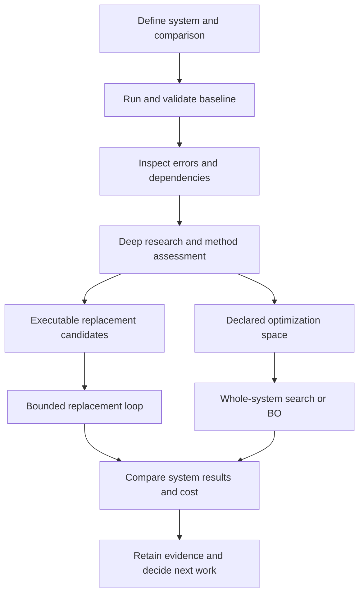

# Workflow and architecture

Bayesian optimization is experimental across all backends. It helps in some cases, but
the examples do not show consistent gains across problems, test prediction, and total runtime.
More testing is needed before broader recommendations. Passing a frozen benchmark gate does not
change this experimental status.

Autoengineering has working research, replacement, and optimization paths. A common orchestration
layer is still missing. This guide describes the current interfaces and where a user or agent must
connect them.



The diagram describes the intended sequence. Research-to-run handoffs require explicit candidate
implementations or evaluator configuration today.

## Define and execute

`System.from_yaml()` loads components, ports, metadata, and directed connections.
`topological_order()`, `upstream_of()`, `downstream_of()`, `describe()`, and `to_mermaid()` support
inspection. Connections retain distinct port pairs between the same components;
`to_networkx()` returns a structural `MultiDiGraph` copy. Reconnecting the same port pair updates
that connection. Port type labels do not provide full unit, shape, or physical validation.

```python
from autoengineering.system import System

system = System.from_yaml("examples/signal_chain/system.yaml")
print(system.describe())
print(system.to_mermaid())
```

Numeric models can be called from a workflow script or through `research.run_component`. A
component's `metadata["runnable"]` declares a Python `module:callable` or a command with NPZ inputs
and outputs. `build_feedforward_runner(system, source_arrays)` builds a callable that walks an
acyclic graph. It snapshots source arrays when constructed and isolates component state and input
arrays on each execution, including inputs shared across branches. Rebuild the runner to change its
source data. Python runnables also receive copied arrays and parameter dictionaries. Models with
additional arithmetic can supply `run_chain(system)` directly; external callable or global state
still requires explicit control.

`swap_component(system, target_name, replacement)` returns a new system with the existing
connections and copied components, including the replacement. A rename to an occupied component
name is rejected. Matching port names alone does not establish compatible units, timing, or semantics.
Adapters and validation still carry that responsibility.

## Validate and prioritize

```python
from autoengineering.validate.compare import validate_arrays
from autoengineering.analyze import generate_report, rank_opportunities

results = validate_arrays(
    "routing", observed, simulated,
    metrics=["rmse", "bias", "nse", "kge"],
    thresholds={"nse": 0.4, "kge": 0.4},
)
priorities = rank_opportunities(results)
report = generate_report(system, results, format="markdown")
```

This snippet assumes a loaded `system` and matching, nonempty, finite, real-valued one-dimensional
`observed` and `simulated` arrays. Validation rejects other shapes rather than broadcasting them,
and raises an error when a selected metric is nonfinite or undefined (for example, NSE for constant
observations). Thresholds must be finite. Direct metric functions enforce the same input-array
contract, but retain their existing undefined-value sentinels.
Available metrics are `rmse`, `bias`, `relative_bias`, `correlation`, `nse`, and `kge`.
NSE, KGE, and correlation pass when they meet or exceed a threshold. Other metrics pass when their
absolute value is at or below the threshold.

`ValidationResult` records the component, metric, value, threshold, and status.
`rank_opportunities` summarizes metric shortfalls. It is a heuristic, not causal attribution or an
estimate of the benefit of a model replacement. Use the
[proposed method assessment](model-improvement.md) before committing to an expensive change.

## Deep research handoff

The agent skills under `.claude/skills/` cover candidate research, citation searches, and execution.
They operate through the tools available to the agent. The Python package does not call an LLM or
search for papers. The `candidates` command only writes a scaffold.

A candidate needs the target component name, compatible ports and inputs, a runnable implementation,
a rationale, and source references. `Candidate`, `load_candidates`, and `save_candidates` provide
serialization. The candidate's `name` identifies the component being replaced. Use its description
and metadata to distinguish alternatives for that component.

Keep unimplemented ideas in the research brief. Before handing a candidate to the loop, run its
adapter on a small input and check its outputs. A reachable citation is not proof that the source
supports the rationale.

## Bounded replacement experiments

```python
from autoengineering.research import auto_improve, load_candidates, write_report

tree = auto_improve(
    system, run_chain, observed,
    validate_output="routing.streamflow",
    candidates=load_candidates("candidates.yaml"),
    metrics=["rmse", "bias", "nse", "kge"],
    thresholds={"nse": 0.4, "kge": 0.4},
    target={"nse": 0.5},
    max_iterations=20,
    workdir="outputs/replacement-study", slug="replacement-study",
)
write_report(tree, system, "replacement-study", "outputs/replacement-study")
```

This snippet assumes a prepared `system`, `run_chain`, observations, and executable candidates.
The [Leaf River example](../examples/leaf_river/README.md) supplies them.

The loop tries each candidate once, in order, against the current retained system. The baseline
remains the experiment tree root. A trial is kept only when fitness strictly increases. Fitness is
the mean of available NSE, KGE, and correlation values, or negative absolute RMSE when no skill
metric is available. Scores are rounded to six decimals. With none of those metrics, fitness is
zero and trials cannot improve it.

Thresholds annotate validation results. They are not hard constraints on retention. A kept trial
can worsen another metric or fail a threshold. Targets stop the loop only when the baseline or a
retained trial meets them; a rejected trial cannot terminate the search. Target values must be
finite. `max_iterations` bounds the number of candidates. Candidate errors, including invalid
validation arrays or undefined metrics, become failed nodes. Supplied runners receive copies of
the baseline and trial systems so component mutations cannot alter retained state. The loop does not provide the BO
controller's cost accounting or durable resume contract, and it does not control stochastic model
seeds. Use a fresh output directory and report all metric tradeoffs.

The loop writes `autoresearch.md`, `autoresearch.jsonl`, and a `CHANGELOG.md` entry. `write_report`
adds a report and provenance sidecar. These are experiment records, not a substitute for a held-out
comparison or an independent assessment of predictive skill.

## Bayesian optimization

`OptimizationRunSpec` defines the objective, scientific constraints, budget, noise, search space,
policy, evaluator, and input identity. `OptimizationStudy` applies the budget and commits action
and result records to `ObservationLedger`. Release A evaluates the complete system for every action.
See the [optimization guide](optimization.md) for the CLI, Python API, artifacts, and recovery rules.

An architecture category can select among implementations already supplied by the evaluator. BO
does not discover, implement, or train a new modeling method automatically. A BO surrogate predicts
outcomes to guide search. A replacement surrogate becomes part of the evaluated model system.
Those roles need separate validation.

## Graph and harness work still needed

`FunctionNetworkSpec` adds immutable function definitions, local parameters, scalar observations,
couplings, costs, and allowed evaluation scopes. `FunctionNetworkEvaluator` writes arrays to
verified NPZ artifacts, and `reconstruct_component_training_tables` rebuilds scalar training data.
Full-observability BO has a passing research gate. Partial-observability BO remains experimental.

These records are foundations for the model DAG. We still need one model identity and dependency
contract across research candidates, training data, model versions, execution, and result lineage.
The runnable and evaluator interfaces are foundations for a harness. They do not yet expose a
unified lifecycle or a web interface. The [roadmap](roadmap.md) defines the intended integration.
