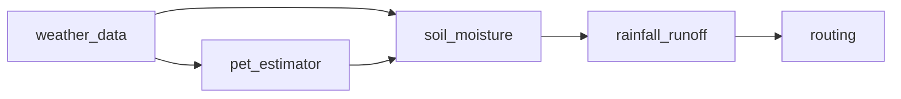

# Leaf River example

This example compares replacements in a five-component rainfall-runoff model using checked USGS
streamflow and NOAA weather data for 2019-2020. It demonstrates model execution, validation,
parameterization swaps, and a bounded candidate loop. It is an exploratory workflow example, not a
held-out forecast validation or a general claim about which hydrologic method performs better.

## Run

From the repository root after `pixi install`:

```sh
pixi run python examples/leaf_river/run_workflow.py
pixi run python examples/leaf_river/run_auto_research.py
```

The first script compares two manually assembled rounds. The second reads
[candidates.yaml](candidates.yaml), tests alternatives in order, and writes an experiment tree,
report, and provenance under `outputs/` in this example directory. That directory is generated and
ignored by Git.

The checked [streamflow](data/streamflow.csv) and [weather](data/weather.csv) files allow an offline
run. [fetch_data.py](data/fetch_data.py) contacts the data services when a cache file is absent.
The cache identifies USGS gage 02472000 and NOAA station USW00003940. The weather station and basin
are distinct spatial supports, which should be considered when interpreting fit.

## Models and alternatives



This is the structural graph. The scripts also supply driver arrays and arithmetic between model
calls. The YAML alone does not describe every numeric operation.

| Component | Baseline | Alternative tested |
| --- | --- | --- |
| PET | Hamon | Hargreaves. |
| Soil moisture | Bucket model | Retained in these comparisons. |
| Runoff | SCS Curve Number | Antecedent moisture adjustment. |
| Routing | Triangular response and baseflow | Gamma response and calibrated baseflow. |

The manual script groups changes into rounds. The automated loop evaluates candidates separately
against the current retained system. It can therefore revert an individual change even when that
change appeared in a manual round with other improvements.

The earlier documentation reported manual NSE values of about 0.23, 0.25, and 0.39, with the
automated loop also reaching about 0.39. Treat these as example outputs to reproduce, not independent
validation evidence. Inspect the generated metric tables and retained, reverted, and failed nodes
before drawing conclusions. The automated loop's fitness and threshold rules are described in the
[workflow guide](../../docs/workflow.md#bounded-replacement-experiments).

## What the example covers

The candidate file illustrates the handoff from research to executable replacements. Running the
script does not conduct a fresh literature search, run BO, or train a statistical or deep learning
model. The comparison data are used during selection, so the selected score is not a held-out test.

A broader example should add a declared evaluation split, data-support checks, compute comparisons,
and result visualizations. The [model improvement guide](../../docs/model-improvement.md) proposes
how to assess those extensions. More examples are being developed separately.
