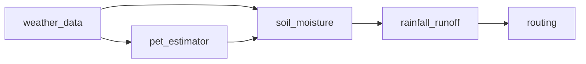

# Leaf River Hydrology Example

A 5-component rainfall-runoff model for the Leaf River near Collins, MS, using real USGS streamflow and NOAA weather data.

## Overview

This example demonstrates the full autoengineering workflow on a real watershed:

1. **Fetch** publicly available data from USGS and NOAA REST APIs
2. **Define** a 5-component system (weather data, PET, soil moisture, runoff, routing)
3. **Validate** each component against observed streamflow and reference models
4. **Analyze** and rank components by improvement potential
5. **Improve** in two rounds, quantifying gains at each step

## Data Sources

| Source | API | Station/Gage | Period |
|---|---|---|---|
| Streamflow | USGS NWIS Daily Values | 02472000 (Leaf River nr Collins, MS) | 2019-2020 |
| Weather | NOAA GHCN Daily | USW00003940 (Jackson, MS area) | 2019-2020 |

Both APIs are free, unauthenticated REST endpoints. The fetched CSV files are checked into this
example.

## Model Chain



| Component | Method | Known Weakness |
|---|---|---|
| PET estimator | Hamon (temp-only) | Underestimates summer PET |
| Soil moisture | Simple bucket (FC=100mm) | Fixed field capacity |
| Rainfall-runoff | SCS Curve Number (CN=75) | No antecedent moisture |
| Routing | Triangular UH + baseflow | Uncalibrated UH shape |

## Improvement Rounds

**Round 1** -- Swap PET: Hamon to Hargreaves. Uses diurnal temperature range (Tmax-Tmin) as a proxy for solar radiation, producing better seasonal PET estimates.

**Round 2** -- Also swap runoff (SCS-CN with antecedent moisture condition adjustment) and routing (gamma-distribution UH with calibrated baseflow).

### Results

```
Metric       Baseline   Round 1   Round 2
rmse           3.0261    2.9877    2.6986
nse            0.2322    0.2515    0.3894
kge            0.4350    0.4717    0.5612
```

Each round improves all three metrics, demonstrating cascading improvement from upstream component fixes.

## Running

```bash
# Manual workflow: swaps done by hand over two rounds
pixi run python examples/leaf_river/run_workflow.py

# Automated: the bounded auto_improve loop reads candidates.yaml and does the
# same swaps itself, writing an experiment tree + evidence-first report
pixi run python examples/leaf_river/run_auto_research.py
```

The checked cache contains about 730 days of USGS and NOAA data, so a fresh checkout runs without
network access. `fetch_data.py` downloads the observations only when the cache files are absent.

The automated run reproduces the improvement (NSE 0.23 -> 0.39) and, because it
evaluates each candidate against the current best, it surfaces something the manual
script glosses: the AMC runoff swap *on its own* does not beat Hargreaves-only, so it
is correctly reverted, and the gain comes from the calibrated routing. See the
generated `outputs/leaf-river.report.md`.

## Files

```
leaf_river/
  system.yaml              # System definition (5 components; swappable ones have a `runnable` block)
  run_workflow.py           # Full 4-step workflow with 2 improvement rounds (manual)
  run_auto_research.py      # Automated bounded auto_improve loop over candidates.yaml
  candidates.yaml           # Researched replacement models (rationale + citations)
  data/
    fetch_data.py           # USGS/NOAA REST API data fetcher with CSV caching
  models/
    pet_hamon.py            # Hamon PET (baseline)
    pet_hargreaves.py       # Hargreaves PET (improved)
    soil_moisture.py        # Simple bucket model
    scs_runoff.py           # Standard SCS Curve Number
    scs_runoff_amc.py       # SCS-CN with antecedent moisture (improved)
    routing.py              # Triangular UH + baseflow (baseline)
    routing_calibrated.py   # Gamma UH + calibrated baseflow (improved)
    routing_runnable.py     # Thin (direct_runoff, recharge) adapters for the runnable contract
  outputs/                  # Generated by run_auto_research.py (gitignored)
```

## Why Leaf River?

- Classic CAMELS benchmark watershed used in many hydrology papers
- Small enough to be fast, complex enough to demonstrate real improvement
- Free data with no authentication required
- 2 years of daily data keeps it lightweight (~730 timesteps)
- Temperature data available for PET estimation methods
