## Target attainment differs across problems

```{=html}
<section class="figure-block" id="target-calls">
<div class="interactive-plot" id="plot-target-calls" role="img" aria-label="Target attainment differs across problems"></div>
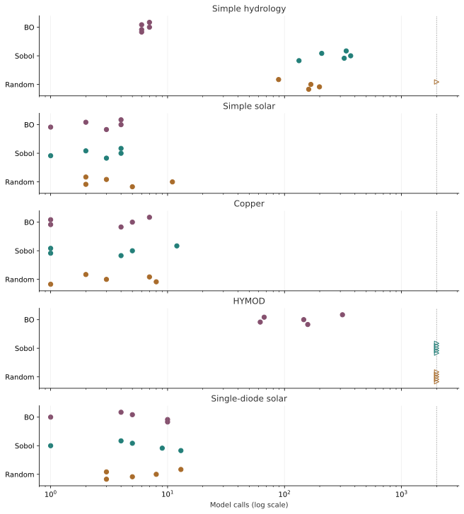
<script type="application/json" id="data-target-calls">{"default": 0, "variants": [{"data": [{"customdata": [[3, "target_reached", 2.169295332362961, 2.1470511060312574], [4, "target_reached", 2.169295332362961, 2.1363234888585785], [5, "target_reached", 2.169295332362961, 2.0879260543352087], [6, "evaluation_cap", 2.169295332362961, 2.1783949225998622], [7, "target_reached", 2.169295332362961, 2.1521504582731623]], "hovertemplate": "Random seed %{customdata[0]}<br>%{x} calls<br>%{customdata[1]}<br>Target %{customdata[2]:.4f}<br>Validation %{customdata[3]:.4f}<extra><\/extra>", "marker": {"color": "#A96C2B", "line": {"width": 1.5}, "size": 10, "symbol": ["circle", "circle", "circle", "triangle-right-open", "circle"]}, "mode": "markers", "name": "Random", "showlegend": false, "x": [161, 199, 168, 2000, 89], "y": [-0.17, -0.085, 0.0, 0.085, 0.17], "type": "scatter", "xaxis": "x", "yaxis": "y"}, {"customdata": [[3, "target_reached", 2.169295332362961, 2.1594096362053903], [4, "target_reached", 2.169295332362961, 2.1110336468254656], [5, "target_reached", 2.169295332362961, 2.1028862464851716], [6, "target_reached", 2.169295332362961, 2.158993279097928], [7, "target_reached", 2.169295332362961, 2.128010893702043]], "hovertemplate": "Sobol seed %{customdata[0]}<br>%{x} calls<br>%{customdata[1]}<br>Target %{customdata[2]:.4f}<br>Validation %{customdata[3]:.4f}<extra><\/extra>", "marker": {"color": "#237F79", "line": {"width": 1.5}, "size": 10, "symbol": ["circle", "circle", "circle", "circle", "circle"]}, "mode": "markers", "name": "Sobol", "showlegend": false, "x": [133, 324, 368, 208, 337], "y": [0.83, 0.915, 1.0, 1.085, 1.17], "type": "scatter", "xaxis": "x", "yaxis": "y"}, {"customdata": [[3, "target_reached", 2.169295332362961, 2.0659955546313915], [4, "target_reached", 2.169295332362961, 2.0659955546313915], [5, "target_reached", 2.169295332362961, 2.0659955546313915], [6, "target_reached", 2.169295332362961, 2.0659955546313915], [7, "target_reached", 2.169295332362961, 2.0659955546313915]], "hovertemplate": "BO seed %{customdata[0]}<br>%{x} calls<br>%{customdata[1]}<br>Target %{customdata[2]:.4f}<br>Validation %{customdata[3]:.4f}<extra><\/extra>", "marker": {"color": "#85506E", "line": {"width": 1.5}, "size": 10, "symbol": ["circle", "circle", "circle", "circle", "circle"]}, "mode": "markers", "name": "BO", "showlegend": false, "x": [6, 6, 7, 6, 7], "y": [1.83, 1.915, 2.0, 2.085, 2.17], "type": "scatter", "xaxis": "x", "yaxis": "y"}, {"customdata": [[3, "target_reached", 183.83143789933789, 175.09818261672692], [4, "target_reached", 183.83143789933789, 175.534471092378], [5, "target_reached", 183.83143789933789, 176.71562050793068], [6, "target_reached", 183.83143789933789, 176.5593466847721], [7, "target_reached", 183.83143789933789, 176.34383678929535]], "hovertemplate": "Random seed %{customdata[0]}<br>%{x} calls<br>%{customdata[1]}<br>Target %{customdata[2]:.4f}<br>Validation %{customdata[3]:.4f}<extra><\/extra>", "marker": {"color": "#A96C2B", "line": {"width": 1.5}, "size": 10, "symbol": ["circle", "circle", "circle", "circle", "circle"]}, "mode": "markers", "name": "Random", "showlegend": false, "x": [5, 2, 11, 3, 2], "y": [-0.17, -0.085, 0.0, 0.085, 0.17], "type": "scatter", "xaxis": "x2", "yaxis": "y2"}, {"customdata": [[3, "target_reached", 183.83143789933789, 176.4353468192891], [4, "target_reached", 183.83143789933789, 180.00165734869987], [5, "target_reached", 183.83143789933789, 176.71567679731896], [6, "target_reached", 183.83143789933789, 180.38855162774908], [7, "target_reached", 183.83143789933789, 176.8924972331747]], "hovertemplate": "Sobol seed %{customdata[0]}<br>%{x} calls<br>%{customdata[1]}<br>Target %{customdata[2]:.4f}<br>Validation %{customdata[3]:.4f}<extra><\/extra>", "marker": {"color": "#237F79", "line": {"width": 1.5}, "size": 10, "symbol": ["circle", "circle", "circle", "circle", "circle"]}, "mode": "markers", "name": "Sobol", "showlegend": false, "x": [3, 1, 4, 2, 4], "y": [0.83, 0.915, 1.0, 1.085, 1.17], "type": "scatter", "xaxis": "x2", "yaxis": "y2"}, {"customdata": [[3, "target_reached", 183.83143789933789, 176.4353468192891], [4, "target_reached", 183.83143789933789, 180.00165734869987], [5, "target_reached", 183.83143789933789, 176.71567679731896], [6, "target_reached", 183.83143789933789, 180.38855162774908], [7, "target_reached", 183.83143789933789, 176.8924972331747]], "hovertemplate": "BO seed %{customdata[0]}<br>%{x} calls<br>%{customdata[1]}<br>Target %{customdata[2]:.4f}<br>Validation %{customdata[3]:.4f}<extra><\/extra>", "marker": {"color": "#85506E", "line": {"width": 1.5}, "size": 10, "symbol": ["circle", "circle", "circle", "circle", "circle"]}, "mode": "markers", "name": "BO", "showlegend": false, "x": [3, 1, 4, 2, 4], "y": [1.83, 1.915, 2.0, 2.085, 2.17], "type": "scatter", "xaxis": "x2", "yaxis": "y2"}, {"customdata": [[3, "target_reached", 0.2057744777270775, 0.1960724758596784], [4, "target_reached", 0.2057744777270775, 0.19830957458889473], [5, "target_reached", 0.2057744777270775, 0.20572891139796573], [6, "target_reached", 0.2057744777270775, 0.19971166313321398], [7, "target_reached", 0.2057744777270775, 0.1959822510548131]], "hovertemplate": "Random seed %{customdata[0]}<br>%{x} calls<br>%{customdata[1]}<br>Target %{customdata[2]:.4f}<br>Validation %{customdata[3]:.4f}<extra><\/extra>", "marker": {"color": "#A96C2B", "line": {"width": 1.5}, "size": 10, "symbol": ["circle", "circle", "circle", "circle", "circle"]}, "mode": "markers", "name": "Random", "showlegend": false, "x": [1, 8, 3, 7, 2], "y": [-0.17, -0.085, 0.0, 0.085, 0.17], "type": "scatter", "xaxis": "x3", "yaxis": "y3"}, {"customdata": [[3, "target_reached", 0.2057744777270775, 0.20416668932215265], [4, "target_reached", 0.2057744777270775, 0.19598354409531066], [5, "target_reached", 0.2057744777270775, 0.1969853492470523], [6, "target_reached", 0.2057744777270775, 0.19646264559703372], [7, "target_reached", 0.2057744777270775, 0.19598145919108328]], "hovertemplate": "Sobol seed %{customdata[0]}<br>%{x} calls<br>%{customdata[1]}<br>Target %{customdata[2]:.4f}<br>Validation %{customdata[3]:.4f}<extra><\/extra>", "marker": {"color": "#237F79", "line": {"width": 1.5}, "size": 10, "symbol": ["circle", "circle", "circle", "circle", "circle"]}, "mode": "markers", "name": "Sobol", "showlegend": false, "x": [4, 1, 5, 1, 12], "y": [0.83, 0.915, 1.0, 1.085, 1.17], "type": "scatter", "xaxis": "x3", "yaxis": "y3"}, {"customdata": [[3, "target_reached", 0.2057744777270775, 0.20416668932215265], [4, "target_reached", 0.2057744777270775, 0.19598354409531066], [5, "target_reached", 0.2057744777270775, 0.19597913769610728], [6, "target_reached", 0.2057744777270775, 0.19646264559703372], [7, "target_reached", 0.2057744777270775, 0.1965047198163146]], "hovertemplate": "BO seed %{customdata[0]}<br>%{x} calls<br>%{customdata[1]}<br>Target %{customdata[2]:.4f}<br>Validation %{customdata[3]:.4f}<extra><\/extra>", "marker": {"color": "#85506E", "line": {"width": 1.5}, "size": 10, "symbol": ["circle", "circle", "circle", "circle", "circle"]}, "mode": "markers", "name": "BO", "showlegend": false, "x": [4, 1, 5, 1, 7], "y": [1.83, 1.915, 2.0, 2.085, 2.17], "type": "scatter", "xaxis": "x3", "yaxis": "y3"}, {"customdata": [[3, "evaluation_cap", 1.1382771629499375, 1.2321137319643258], [4, "evaluation_cap", 1.1382771629499375, 1.2609900050331424], [5, "evaluation_cap", 1.1382771629499375, 1.3142162350911126], [6, "evaluation_cap", 1.1382771629499375, 1.2004920763963522], [7, "evaluation_cap", 1.1382771629499375, 1.2399411265032836]], "hovertemplate": "Random seed %{customdata[0]}<br>%{x} calls<br>%{customdata[1]}<br>Target %{customdata[2]:.4f}<br>Validation %{customdata[3]:.4f}<extra><\/extra>", "marker": {"color": "#A96C2B", "line": {"width": 1.5}, "size": 10, "symbol": ["triangle-right-open", "triangle-right-open", "triangle-right-open", "triangle-right-open", "triangle-right-open"]}, "mode": "markers", "name": "Random", "showlegend": false, "x": [2000, 2000, 2000, 2000, 2000], "y": [-0.17, -0.085, 0.0, 0.085, 0.17], "type": "scatter", "xaxis": "x4", "yaxis": "y4"}, {"customdata": [[3, "evaluation_cap", 1.1382771629499375, 1.2409272271422602], [4, "evaluation_cap", 1.1382771629499375, 1.257656531637341], [5, "evaluation_cap", 1.1382771629499375, 1.2428524475972256], [6, "evaluation_cap", 1.1382771629499375, 1.1782878935588688], [7, "evaluation_cap", 1.1382771629499375, 1.244145062404692]], "hovertemplate": "Sobol seed %{customdata[0]}<br>%{x} calls<br>%{customdata[1]}<br>Target %{customdata[2]:.4f}<br>Validation %{customdata[3]:.4f}<extra><\/extra>", "marker": {"color": "#237F79", "line": {"width": 1.5}, "size": 10, "symbol": ["triangle-right-open", "triangle-right-open", "triangle-right-open", "triangle-right-open", "triangle-right-open"]}, "mode": "markers", "name": "Sobol", "showlegend": false, "x": [2000, 2000, 2000, 2000, 2000], "y": [0.83, 0.915, 1.0, 1.085, 1.17], "type": "scatter", "xaxis": "x4", "yaxis": "y4"}, {"customdata": [[3, "target_reached", 1.1382771629499375, 1.136279936576662], [4, "target_reached", 1.1382771629499375, 1.128073589616546], [5, "target_reached", 1.1382771629499375, 1.1278788060587643], [6, "target_reached", 1.1382771629499375, 1.1345313084975843], [7, "target_reached", 1.1382771629499375, 1.132346243963679]], "hovertemplate": "BO seed %{customdata[0]}<br>%{x} calls<br>%{customdata[1]}<br>Target %{customdata[2]:.4f}<br>Validation %{customdata[3]:.4f}<extra><\/extra>", "marker": {"color": "#85506E", "line": {"width": 1.5}, "size": 10, "symbol": ["circle", "circle", "circle", "circle", "circle"]}, "mode": "markers", "name": "BO", "showlegend": false, "x": [158, 62, 146, 67, 313], "y": [1.83, 1.915, 2.0, 2.085, 2.17], "type": "scatter", "xaxis": "x4", "yaxis": "y4"}, {"customdata": [[3, "target_reached", 182.10662824491178, 179.67599970223029], [4, "target_reached", 182.10662824491178, 174.52558844617283], [5, "target_reached", 182.10662824491178, 180.53873600008328], [6, "target_reached", 182.10662824491178, 175.414405410332], [7, "target_reached", 182.10662824491178, 175.0871725624283]], "hovertemplate": "Random seed %{customdata[0]}<br>%{x} calls<br>%{customdata[1]}<br>Target %{customdata[2]:.4f}<br>Validation %{customdata[3]:.4f}<extra><\/extra>", "marker": {"color": "#A96C2B", "line": {"width": 1.5}, "size": 10, "symbol": ["circle", "circle", "circle", "circle", "circle"]}, "mode": "markers", "name": "Random", "showlegend": false, "x": [3, 5, 8, 3, 13], "y": [-0.17, -0.085, 0.0, 0.085, 0.17], "type": "scatter", "xaxis": "x5", "yaxis": "y5"}, {"customdata": [[3, "target_reached", 182.10662824491178, 181.21828026071273], [4, "target_reached", 182.10662824491178, 181.736419852539], [5, "target_reached", 182.10662824491178, 178.84804051742753], [6, "target_reached", 182.10662824491178, 175.68712758920097], [7, "target_reached", 182.10662824491178, 182.1031038282294]], "hovertemplate": "Sobol seed %{customdata[0]}<br>%{x} calls<br>%{customdata[1]}<br>Target %{customdata[2]:.4f}<br>Validation %{customdata[3]:.4f}<extra><\/extra>", "marker": {"color": "#237F79", "line": {"width": 1.5}, "size": 10, "symbol": ["circle", "circle", "circle", "circle", "circle"]}, "mode": "markers", "name": "Sobol", "showlegend": false, "x": [13, 9, 1, 5, 4], "y": [0.83, 0.915, 1.0, 1.085, 1.17], "type": "scatter", "xaxis": "x5", "yaxis": "y5"}, {"customdata": [[3, "target_reached", 182.10662824491178, 178.90082647304618], [4, "target_reached", 182.10662824491178, 176.97847571102696], [5, "target_reached", 182.10662824491178, 178.84804051742753], [6, "target_reached", 182.10662824491178, 175.68712758920097], [7, "target_reached", 182.10662824491178, 182.1031038282294]], "hovertemplate": "BO seed %{customdata[0]}<br>%{x} calls<br>%{customdata[1]}<br>Target %{customdata[2]:.4f}<br>Validation %{customdata[3]:.4f}<extra><\/extra>", "marker": {"color": "#85506E", "line": {"width": 1.5}, "size": 10, "symbol": ["circle", "circle", "circle", "circle", "circle"]}, "mode": "markers", "name": "BO", "showlegend": false, "x": [10, 10, 1, 5, 4], "y": [1.83, 1.915, 2.0, 2.085, 2.17], "type": "scatter", "xaxis": "x5", "yaxis": "y5"}], "layout": {"template": {"data": {"scatter": [{"type": "scatter"}]}}, "xaxis": {"anchor": "y", "domain": [0.0, 1.0], "matches": "x5", "showticklabels": false, "type": "log", "range": [-0.09691001300805639, 3.4913616938342726], "tickmode": "array", "tickvals": [1, 10, 100, 1000, 2000], "minorloglabels": "none", "title": {"standoff": 12}, "automargin": true, "gridcolor": "#dddddd", "zeroline": false}, "yaxis": {"anchor": "x", "domain": [0.844, 1.0], "tickvals": [0, 1, 2], "ticktext": ["Random", "Sobol", "BO"], "range": [-0.4, 2.4], "title": {"standoff": 12}, "automargin": true, "gridcolor": "#dddddd", "zeroline": false}, "xaxis2": {"anchor": "y2", "domain": [0.0, 1.0], "matches": "x5", "showticklabels": false, "type": "log", "range": [-0.09691001300805639, 3.4913616938342726], "tickmode": "array", "tickvals": [1, 10, 100, 1000, 2000], "minorloglabels": "none", "title": {"standoff": 12}, "automargin": true, "gridcolor": "#dddddd", "zeroline": false}, "yaxis2": {"anchor": "x2", "domain": [0.633, 0.789], "tickvals": [0, 1, 2], "ticktext": ["Random", "Sobol", "BO"], "range": [-0.4, 2.4], "title": {"standoff": 12}, "automargin": true, "gridcolor": "#dddddd", "zeroline": false}, "xaxis3": {"anchor": "y3", "domain": [0.0, 1.0], "matches": "x5", "showticklabels": false, "type": "log", "range": [-0.09691001300805639, 3.4913616938342726], "tickmode": "array", "tickvals": [1, 10, 100, 1000, 2000], "minorloglabels": "none", "title": {"standoff": 12}, "automargin": true, "gridcolor": "#dddddd", "zeroline": false}, "yaxis3": {"anchor": "x3", "domain": [0.422, 0.578], "tickvals": [0, 1, 2], "ticktext": ["Random", "Sobol", "BO"], "range": [-0.4, 2.4], "title": {"standoff": 12}, "automargin": true, "gridcolor": "#dddddd", "zeroline": false}, "xaxis4": {"anchor": "y4", "domain": [0.0, 1.0], "matches": "x5", "showticklabels": false, "type": "log", "range": [-0.09691001300805639, 3.4913616938342726], "tickmode": "array", "tickvals": [1, 10, 100, 1000, 2000], "minorloglabels": "none", "title": {"standoff": 12}, "automargin": true, "gridcolor": "#dddddd", "zeroline": false}, "yaxis4": {"anchor": "x4", "domain": [0.211, 0.367], "tickvals": [0, 1, 2], "ticktext": ["Random", "Sobol", "BO"], "range": [-0.4, 2.4], "title": {"standoff": 12}, "automargin": true, "gridcolor": "#dddddd", "zeroline": false}, "xaxis5": {"anchor": "y5", "domain": [0.0, 1.0], "type": "log", "range": [-0.09691001300805639, 3.4913616938342726], "tickmode": "array", "tickvals": [1, 10, 100, 1000, 2000], "minorloglabels": "none", "title": {"text": "Model calls (log scale)", "standoff": 12}, "automargin": true, "gridcolor": "#dddddd", "zeroline": false}, "yaxis5": {"anchor": "x5", "domain": [0.0, 0.156], "tickvals": [0, 1, 2], "ticktext": ["Random", "Sobol", "BO"], "range": [-0.4, 2.4], "title": {"standoff": 12}, "automargin": true, "gridcolor": "#dddddd", "zeroline": false}, "annotations": [{"font": {"size": 16}, "showarrow": false, "text": "Simple hydrology", "x": 0.5, "xanchor": "center", "xref": "paper", "y": 1.0, "yanchor": "bottom", "yref": "paper"}, {"font": {"size": 16}, "showarrow": false, "text": "Simple solar", "x": 0.5, "xanchor": "center", "xref": "paper", "y": 0.789, "yanchor": "bottom", "yref": "paper"}, {"font": {"size": 16}, "showarrow": false, "text": "Copper", "x": 0.5, "xanchor": "center", "xref": "paper", "y": 0.578, "yanchor": "bottom", "yref": "paper"}, {"font": {"size": 16}, "showarrow": false, "text": "HYMOD", "x": 0.5, "xanchor": "center", "xref": "paper", "y": 0.367, "yanchor": "bottom", "yref": "paper"}, {"font": {"size": 16}, "showarrow": false, "text": "Single-diode solar", "x": 0.5, "xanchor": "center", "xref": "paper", "y": 0.156, "yanchor": "bottom", "yref": "paper"}], "shapes": [{"line": {"color": "#888888", "dash": "dot"}, "type": "line", "x0": 2000, "x1": 2000, "xref": "x", "y0": 0, "y1": 1, "yref": "y domain"}, {"line": {"color": "#888888", "dash": "dot"}, "type": "line", "x0": 2000, "x1": 2000, "xref": "x2", "y0": 0, "y1": 1, "yref": "y2 domain"}, {"line": {"color": "#888888", "dash": "dot"}, "type": "line", "x0": 2000, "x1": 2000, "xref": "x3", "y0": 0, "y1": 1, "yref": "y3 domain"}, {"line": {"color": "#888888", "dash": "dot"}, "type": "line", "x0": 2000, "x1": 2000, "xref": "x4", "y0": 0, "y1": 1, "yref": "y4 domain"}, {"line": {"color": "#888888", "dash": "dot"}, "type": "line", "x0": 2000, "x1": 2000, "xref": "x5", "y0": 0, "y1": 1, "yref": "y5 domain"}], "font": {"family": "Arial, sans-serif", "size": 13, "color": "#333333"}, "margin": {"t": 35, "r": 25, "b": 85, "l": 75}, "legend": {"orientation": "h", "x": 0, "y": -0.2, "xanchor": "left", "yanchor": "top"}, "hoverlabel": {"font": {"size": 12}}, "title": {}, "height": 1030, "autosize": true, "paper_bgcolor": "rgba(0,0,0,0)", "plot_bgcolor": "rgba(0,0,0,0)", "showlegend": false}}]}</script>
</section>
```

Each point is one seed. Filled circles reached the frozen validation target; open right-facing triangles exhausted the cap and remain censored. Small vertical offsets separate seeds. The dotted line marks the cap. Easy cases often finish during Sobol initialization, before BO makes an adaptive suggestion.

## Validation gains do not guarantee better test prediction

```{=html}
<section class="figure-block" id="fixed-progress">
<label class="plot-control" for="select-fixed-progress">View: <select id="select-fixed-progress" aria-label="Choose view for Validation gains do not guarantee better test prediction">
<option value="0" >Simple hydrology</option>
<option value="1" >Simple solar</option>
<option value="2" >Copper</option>
<option value="3" selected>HYMOD</option>
<option value="4" >Single-diode solar</option>
</select></label>
<div class="interactive-plot" id="plot-fixed-progress" role="img" aria-label="Validation gains do not guarantee better test prediction"></div>
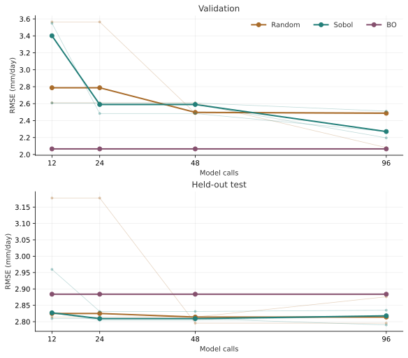
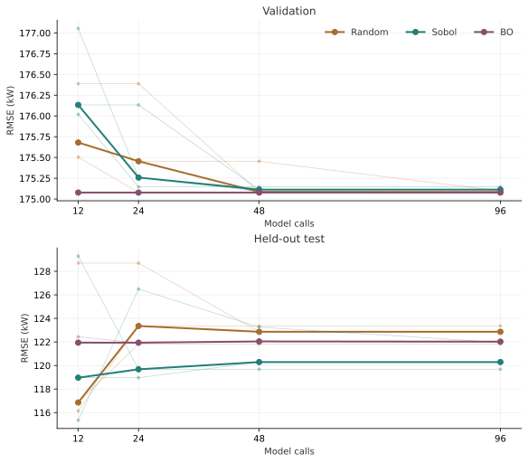
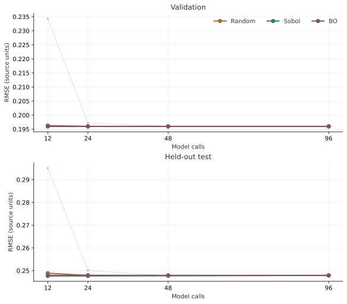
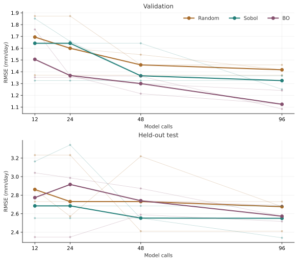
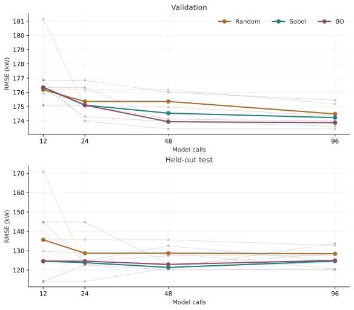
<script type="application/json" id="data-fixed-progress">{"default": 3, "variants": [{"data": [{"hovertemplate": "Random seed 0<br>Calls %{x}<br>RMSE %{y:.4f}<extra><\/extra>", "line": {"color": "#A96C2B", "width": 1}, "marker": {"size": 4}, "mode": "lines+markers", "name": "Random, seed 0", "opacity": 0.35, "showlegend": false, "x": [12, 24, 48, 96], "y": [3.5643115938853236, 3.5643115938853236, 2.4865417070221314, 2.4865417070221314], "type": "scatter", "xaxis": "x", "yaxis": "y"}, {"hovertemplate": "Random seed 1<br>Calls %{x}<br>RMSE %{y:.4f}<extra><\/extra>", "line": {"color": "#A96C2B", "width": 1}, "marker": {"size": 4}, "mode": "lines+markers", "name": "Random, seed 1", "opacity": 0.35, "showlegend": false, "x": [12, 24, 48, 96], "y": [2.6104276849140033, 2.6104276849140033, 2.6104276849140033, 2.0813210754763407], "type": "scatter", "xaxis": "x", "yaxis": "y"}, {"hovertemplate": "Random seed 2<br>Calls %{x}<br>RMSE %{y:.4f}<extra><\/extra>", "line": {"color": "#A96C2B", "width": 1}, "marker": {"size": 4}, "mode": "lines+markers", "name": "Random, seed 2", "opacity": 0.35, "showlegend": false, "x": [12, 24, 48, 96], "y": [2.7875932684277474, 2.7875932684277474, 2.4971830746336123, 2.4971830746336123], "type": "scatter", "xaxis": "x", "yaxis": "y"}, {"hovertemplate": "Random median<br>Calls %{x}<br>RMSE %{y:.4f}<extra><\/extra>", "line": {"color": "#A96C2B", "width": 3}, "marker": {"size": 7}, "mode": "lines+markers", "name": "Random", "showlegend": true, "x": [12, 24, 48, 96], "y": {"dtype": "f8", "bdata": "TZMTs/1MBkBNkxOz/UwGQKNorR47+gNAimZ++m/kA0A="}, "type": "scatter", "xaxis": "x", "yaxis": "y"}, {"hovertemplate": "Sobol seed 0<br>Calls %{x}<br>RMSE %{y:.4f}<extra><\/extra>", "line": {"color": "#237F79", "width": 1}, "marker": {"size": 4}, "mode": "lines+markers", "name": "Sobol, seed 0", "opacity": 0.35, "showlegend": false, "x": [12, 24, 48, 96], "y": [3.401117447201036, 2.5898775711961144, 2.5898775711961144, 2.1961420965485825], "type": "scatter", "xaxis": "x", "yaxis": "y"}, {"hovertemplate": "Sobol seed 1<br>Calls %{x}<br>RMSE %{y:.4f}<extra><\/extra>", "line": {"color": "#237F79", "width": 1}, "marker": {"size": 4}, "mode": "lines+markers", "name": "Sobol, seed 1", "opacity": 0.35, "showlegend": false, "x": [12, 24, 48, 96], "y": [2.6076476742303027, 2.6076476742303027, 2.6076476742303027, 2.511946223420028], "type": "scatter", "xaxis": "x", "yaxis": "y"}, {"hovertemplate": "Sobol seed 2<br>Calls %{x}<br>RMSE %{y:.4f}<extra><\/extra>", "line": {"color": "#237F79", "width": 1}, "marker": {"size": 4}, "mode": "lines+markers", "name": "Sobol, seed 2", "opacity": 0.35, "showlegend": false, "x": [12, 24, 48, 96], "y": [3.548664124657178, 2.4836531747465003, 2.4836531747465003, 2.270650852440263], "type": "scatter", "xaxis": "x", "yaxis": "y"}, {"hovertemplate": "Sobol median<br>Calls %{x}<br>RMSE %{y:.4f}<extra><\/extra>", "line": {"color": "#237F79", "width": 3}, "marker": {"size": 7}, "mode": "lines+markers", "name": "Sobol", "showlegend": true, "x": [12, 24, 48, 96], "y": {"dtype": "f8", "bdata": "66psEH01C0Alc2e7EbgEQCVzZ7sRuARAcux+/koqAkA="}, "type": "scatter", "xaxis": "x", "yaxis": "y"}, {"hovertemplate": "BO seed 0<br>Calls %{x}<br>RMSE %{y:.4f}<extra><\/extra>", "line": {"color": "#85506E", "width": 1}, "marker": {"size": 4}, "mode": "lines+markers", "name": "BO, seed 0", "opacity": 0.35, "showlegend": false, "x": [12, 24, 48, 96], "y": [2.0659955546313915, 2.0659955546313915, 2.0659955546313915, 2.0659955546313915], "type": "scatter", "xaxis": "x", "yaxis": "y"}, {"hovertemplate": "BO seed 1<br>Calls %{x}<br>RMSE %{y:.4f}<extra><\/extra>", "line": {"color": "#85506E", "width": 1}, "marker": {"size": 4}, "mode": "lines+markers", "name": "BO, seed 1", "opacity": 0.35, "showlegend": false, "x": [12, 24, 48, 96], "y": [2.0659955546313915, 2.0659955546313915, 2.0659955546313915, 2.0659955546313915], "type": "scatter", "xaxis": "x", "yaxis": "y"}, {"hovertemplate": "BO seed 2<br>Calls %{x}<br>RMSE %{y:.4f}<extra><\/extra>", "line": {"color": "#85506E", "width": 1}, "marker": {"size": 4}, "mode": "lines+markers", "name": "BO, seed 2", "opacity": 0.35, "showlegend": false, "x": [12, 24, 48, 96], "y": [2.0659955546313915, 2.0659955546313915, 2.0659955546313915, 2.0659955546313915], "type": "scatter", "xaxis": "x", "yaxis": "y"}, {"hovertemplate": "BO median<br>Calls %{x}<br>RMSE %{y:.4f}<extra><\/extra>", "line": {"color": "#85506E", "width": 3}, "marker": {"size": 7}, "mode": "lines+markers", "name": "BO", "showlegend": true, "x": [12, 24, 48, 96], "y": {"dtype": "f8", "bdata": "7pVmrSiHAEDulWatKIcAQO6VZq0ohwBA7pVmrSiHAEA="}, "type": "scatter", "xaxis": "x", "yaxis": "y"}, {"hovertemplate": "Random seed 0<br>Calls %{x}<br>RMSE %{y:.4f}<extra><\/extra>", "line": {"color": "#A96C2B", "width": 1}, "marker": {"size": 4}, "mode": "lines+markers", "name": "Random, seed 0", "opacity": 0.35, "showlegend": false, "x": [12, 24, 48, 96], "y": [3.177786883119426, 3.177786883119426, 2.7954984346518255, 2.7954984346518255], "type": "scatter", "xaxis": "x2", "yaxis": "y2"}, {"hovertemplate": "Random seed 1<br>Calls %{x}<br>RMSE %{y:.4f}<extra><\/extra>", "line": {"color": "#A96C2B", "width": 1}, "marker": {"size": 4}, "mode": "lines+markers", "name": "Random, seed 1", "opacity": 0.35, "showlegend": false, "x": [12, 24, 48, 96], "y": [2.8141829785445234, 2.8141829785445234, 2.8141829785445234, 2.8759980113739565], "type": "scatter", "xaxis": "x2", "yaxis": "y2"}, {"hovertemplate": "Random seed 2<br>Calls %{x}<br>RMSE %{y:.4f}<extra><\/extra>", "line": {"color": "#A96C2B", "width": 1}, "marker": {"size": 4}, "mode": "lines+markers", "name": "Random, seed 2", "opacity": 0.35, "showlegend": false, "x": [12, 24, 48, 96], "y": [2.825034763237747, 2.825034763237747, 2.8140963767874423, 2.8140963767874423], "type": "scatter", "xaxis": "x2", "yaxis": "y2"}, {"hovertemplate": "Random median<br>Calls %{x}<br>RMSE %{y:.4f}<extra><\/extra>", "line": {"color": "#A96C2B", "width": 3}, "marker": {"size": 7}, "mode": "lines+markers", "name": "Random", "showlegend": false, "x": [12, 24, 48, 96], "y": {"dtype": "f8", "bdata": "k1px06uZBkCTWnHTq5kGQNbAEPZEgwZA1sAQ9kSDBkA="}, "type": "scatter", "xaxis": "x2", "yaxis": "y2"}, {"hovertemplate": "Sobol seed 0<br>Calls %{x}<br>RMSE %{y:.4f}<extra><\/extra>", "line": {"color": "#237F79", "width": 1}, "marker": {"size": 4}, "mode": "lines+markers", "name": "Sobol, seed 0", "opacity": 0.35, "showlegend": false, "x": [12, 24, 48, 96], "y": [2.9597324740337205, 2.8312695988619847, 2.8312695988619847, 2.8350857743188187], "type": "scatter", "xaxis": "x2", "yaxis": "y2"}, {"hovertemplate": "Sobol seed 1<br>Calls %{x}<br>RMSE %{y:.4f}<extra><\/extra>", "line": {"color": "#237F79", "width": 1}, "marker": {"size": 4}, "mode": "lines+markers", "name": "Sobol, seed 1", "opacity": 0.35, "showlegend": false, "x": [12, 24, 48, 96], "y": [2.809316362939026, 2.809316362939026, 2.809316362939026, 2.7899387731583314], "type": "scatter", "xaxis": "x2", "yaxis": "y2"}, {"hovertemplate": "Sobol seed 2<br>Calls %{x}<br>RMSE %{y:.4f}<extra><\/extra>", "line": {"color": "#237F79", "width": 1}, "marker": {"size": 4}, "mode": "lines+markers", "name": "Sobol, seed 2", "opacity": 0.35, "showlegend": false, "x": [12, 24, 48, 96], "y": [2.827093803569717, 2.804504670305184, 2.804504670305184, 2.817887803481688], "type": "scatter", "xaxis": "x2", "yaxis": "y2"}, {"hovertemplate": "Sobol median<br>Calls %{x}<br>RMSE %{y:.4f}<extra><\/extra>", "line": {"color": "#237F79", "width": 3}, "marker": {"size": 7}, "mode": "lines+markers", "name": "Sobol", "showlegend": false, "x": [12, 24, 48, 96], "y": {"dtype": "f8", "bdata": "EHMoW+OdBkC5hnfbenkGQLmGd9t6eQZATgK+wgiLBkA="}, "type": "scatter", "xaxis": "x2", "yaxis": "y2"}, {"hovertemplate": "BO seed 0<br>Calls %{x}<br>RMSE %{y:.4f}<extra><\/extra>", "line": {"color": "#85506E", "width": 1}, "marker": {"size": 4}, "mode": "lines+markers", "name": "BO, seed 0", "opacity": 0.35, "showlegend": false, "x": [12, 24, 48, 96], "y": [2.8839228598885933, 2.8839228598885933, 2.8839228598885933, 2.8839228598885933], "type": "scatter", "xaxis": "x2", "yaxis": "y2"}, {"hovertemplate": "BO seed 1<br>Calls %{x}<br>RMSE %{y:.4f}<extra><\/extra>", "line": {"color": "#85506E", "width": 1}, "marker": {"size": 4}, "mode": "lines+markers", "name": "BO, seed 1", "opacity": 0.35, "showlegend": false, "x": [12, 24, 48, 96], "y": [2.8839228598885933, 2.8839228598885933, 2.8839228598885933, 2.8839228598885933], "type": "scatter", "xaxis": "x2", "yaxis": "y2"}, {"hovertemplate": "BO seed 2<br>Calls %{x}<br>RMSE %{y:.4f}<extra><\/extra>", "line": {"color": "#85506E", "width": 1}, "marker": {"size": 4}, "mode": "lines+markers", "name": "BO, seed 2", "opacity": 0.35, "showlegend": false, "x": [12, 24, 48, 96], "y": [2.8839228598885933, 2.8839228598885933, 2.8839228598885933, 2.8839228598885933], "type": "scatter", "xaxis": "x2", "yaxis": "y2"}, {"hovertemplate": "BO median<br>Calls %{x}<br>RMSE %{y:.4f}<extra><\/extra>", "line": {"color": "#85506E", "width": 3}, "marker": {"size": 7}, "mode": "lines+markers", "name": "BO", "showlegend": false, "x": [12, 24, 48, 96], "y": {"dtype": "f8", "bdata": "MkT7JUYSB0AyRPslRhIHQDJE+yVGEgdAMkT7JUYSB0A="}, "type": "scatter", "xaxis": "x2", "yaxis": "y2"}], "layout": {"template": {"data": {"scatter": [{"type": "scatter"}]}}, "xaxis": {"anchor": "y", "domain": [0.0, 1.0], "title": {"text": "Model calls", "standoff": 12}, "tickvals": [12, 24, 48, 96], "automargin": true, "gridcolor": "#dddddd", "zeroline": false}, "yaxis": {"anchor": "x", "domain": [0.6000000000000001, 1.0], "title": {"text": "RMSE (mm/day)", "standoff": 12}, "automargin": true, "gridcolor": "#dddddd", "zeroline": false}, "xaxis2": {"anchor": "y2", "domain": [0.0, 1.0], "title": {"text": "Model calls", "standoff": 12}, "tickvals": [12, 24, 48, 96], "automargin": true, "gridcolor": "#dddddd", "zeroline": false}, "yaxis2": {"anchor": "x2", "domain": [0.0, 0.4], "title": {"text": "RMSE (mm/day)", "standoff": 12}, "automargin": true, "gridcolor": "#dddddd", "zeroline": false}, "annotations": [{"font": {"size": 16}, "showarrow": false, "text": "Validation: used for selection", "x": 0.5, "xanchor": "center", "xref": "paper", "y": 1.0, "yanchor": "bottom", "yref": "paper"}, {"font": {"size": 16}, "showarrow": false, "text": "Test: revealed after selection", "x": 0.5, "xanchor": "center", "xref": "paper", "y": 0.4, "yanchor": "bottom", "yref": "paper"}], "font": {"family": "Arial, sans-serif", "size": 13, "color": "#333333"}, "margin": {"t": 35, "r": 25, "b": 160, "l": 75}, "legend": {"orientation": "h", "x": 0, "y": -0.2, "xanchor": "left", "yanchor": "top"}, "hoverlabel": {"font": {"size": 12}}, "title": {}, "height": 760, "autosize": true, "paper_bgcolor": "rgba(0,0,0,0)", "plot_bgcolor": "rgba(0,0,0,0)", "showlegend": true}}, {"data": [{"hovertemplate": "Random seed 0<br>Calls %{x}<br>RMSE %{y:.4f}<extra><\/extra>", "line": {"color": "#A96C2B", "width": 1}, "marker": {"size": 4}, "mode": "lines+markers", "name": "Random, seed 0", "opacity": 0.35, "showlegend": false, "x": [12, 24, 48, 96], "y": [175.6803212316816, 175.45455563953095, 175.45455563953095, 175.0964109792146], "type": "scatter", "xaxis": "x", "yaxis": "y"}, {"hovertemplate": "Random seed 1<br>Calls %{x}<br>RMSE %{y:.4f}<extra><\/extra>", "line": {"color": "#A96C2B", "width": 1}, "marker": {"size": 4}, "mode": "lines+markers", "name": "Random, seed 1", "opacity": 0.35, "showlegend": false, "x": [12, 24, 48, 96], "y": [175.50436318663702, 175.07793636465613, 175.07793636465613, 175.07793636465613], "type": "scatter", "xaxis": "x", "yaxis": "y"}, {"hovertemplate": "Random seed 2<br>Calls %{x}<br>RMSE %{y:.4f}<extra><\/extra>", "line": {"color": "#A96C2B", "width": 1}, "marker": {"size": 4}, "mode": "lines+markers", "name": "Random, seed 2", "opacity": 0.35, "showlegend": false, "x": [12, 24, 48, 96], "y": [176.3887911981306, 176.3887911981306, 175.0851159156334, 175.0851159156334], "type": "scatter", "xaxis": "x", "yaxis": "y"}, {"hovertemplate": "Random median<br>Calls %{x}<br>RMSE %{y:.4f}<extra><\/extra>", "line": {"color": "#A96C2B", "width": 3}, "marker": {"size": 7}, "mode": "lines+markers", "name": "Random", "showlegend": true, "x": [12, 24, 48, 96], "y": {"dtype": "f8", "bdata": "GhsIMcX1ZUDuv0S4i+5lQHdAA0W54mVAd0ADRbniZUA="}, "type": "scatter", "xaxis": "x", "yaxis": "y"}, {"hovertemplate": "Sobol seed 0<br>Calls %{x}<br>RMSE %{y:.4f}<extra><\/extra>", "line": {"color": "#237F79", "width": 1}, "marker": {"size": 4}, "mode": "lines+markers", "name": "Sobol, seed 0", "opacity": 0.35, "showlegend": false, "x": [12, 24, 48, 96], "y": [176.0199143850484, 175.14632469072916, 175.14632469072916, 175.14632469072916], "type": "scatter", "xaxis": "x", "yaxis": "y"}, {"hovertemplate": "Sobol seed 1<br>Calls %{x}<br>RMSE %{y:.4f}<extra><\/extra>", "line": {"color": "#237F79", "width": 1}, "marker": {"size": 4}, "mode": "lines+markers", "name": "Sobol, seed 1", "opacity": 0.35, "showlegend": false, "x": [12, 24, 48, 96], "y": [176.13317631180675, 176.13317631180675, 175.11339502934877, 175.11339502934877], "type": "scatter", "xaxis": "x", "yaxis": "y"}, {"hovertemplate": "Sobol seed 2<br>Calls %{x}<br>RMSE %{y:.4f}<extra><\/extra>", "line": {"color": "#237F79", "width": 1}, "marker": {"size": 4}, "mode": "lines+markers", "name": "Sobol, seed 2", "opacity": 0.35, "showlegend": false, "x": [12, 24, 48, 96], "y": [177.05495208936324, 175.25841792389534, 175.09340922185277, 175.07753767594625], "type": "scatter", "xaxis": "x", "yaxis": "y"}, {"hovertemplate": "Sobol median<br>Calls %{x}<br>RMSE %{y:.4f}<extra><\/extra>", "line": {"color": "#237F79", "width": 3}, "marker": {"size": 7}, "mode": "lines+markers", "name": "Sobol", "showlegend": true, "x": [12, 24, 48, 96], "y": {"dtype": "f8", "bdata": "+/n3+kIEZkCVeqr1ROhlQJ/SnO6g42VAn9Kc7qDjZUA="}, "type": "scatter", "xaxis": "x", "yaxis": "y"}, {"hovertemplate": "BO seed 0<br>Calls %{x}<br>RMSE %{y:.4f}<extra><\/extra>", "line": {"color": "#85506E", "width": 1}, "marker": {"size": 4}, "mode": "lines+markers", "name": "BO, seed 0", "opacity": 0.35, "showlegend": false, "x": [12, 24, 48, 96], "y": [175.0775599041313, 175.0775599041313, 175.07752209494612, 175.07750609711547], "type": "scatter", "xaxis": "x", "yaxis": "y"}, {"hovertemplate": "BO seed 1<br>Calls %{x}<br>RMSE %{y:.4f}<extra><\/extra>", "line": {"color": "#85506E", "width": 1}, "marker": {"size": 4}, "mode": "lines+markers", "name": "BO, seed 1", "opacity": 0.35, "showlegend": false, "x": [12, 24, 48, 96], "y": [175.0775624702757, 175.0775624702757, 175.07750494311597, 175.0775041717465], "type": "scatter", "xaxis": "x", "yaxis": "y"}, {"hovertemplate": "BO seed 2<br>Calls %{x}<br>RMSE %{y:.4f}<extra><\/extra>", "line": {"color": "#85506E", "width": 1}, "marker": {"size": 4}, "mode": "lines+markers", "name": "BO, seed 2", "opacity": 0.35, "showlegend": false, "x": [12, 24, 48, 96], "y": [175.0794632912374, 175.07760391281883, 175.0775155422358, 175.07750630516097], "type": "scatter", "xaxis": "x", "yaxis": "y"}, {"hovertemplate": "BO median<br>Calls %{x}<br>RMSE %{y:.4f}<extra><\/extra>", "line": {"color": "#85506E", "width": 3}, "marker": {"size": 7}, "mode": "lines+markers", "name": "BO", "showlegend": true, "x": [12, 24, 48, 96], "y": {"dtype": "f8", "bdata": "ZSdKZHviZUBlJ0pke+JlQLTa3wF74mVAQAsR7nriZUA="}, "type": "scatter", "xaxis": "x", "yaxis": "y"}, {"hovertemplate": "Random seed 0<br>Calls %{x}<br>RMSE %{y:.4f}<extra><\/extra>", "line": {"color": "#A96C2B", "width": 1}, "marker": {"size": 4}, "mode": "lines+markers", "name": "Random, seed 0", "opacity": 0.35, "showlegend": false, "x": [12, 24, 48, 96], "y": [116.14072705964573, 123.35457834870547, 123.35457834870547, 123.37036274857611], "type": "scatter", "xaxis": "x2", "yaxis": "y2"}, {"hovertemplate": "Random seed 1<br>Calls %{x}<br>RMSE %{y:.4f}<extra><\/extra>", "line": {"color": "#A96C2B", "width": 1}, "marker": {"size": 4}, "mode": "lines+markers", "name": "Random, seed 1", "opacity": 0.35, "showlegend": false, "x": [12, 24, 48, 96], "y": [116.85769314377879, 121.815476461917, 121.815476461917, 121.815476461917], "type": "scatter", "xaxis": "x2", "yaxis": "y2"}, {"hovertemplate": "Random seed 2<br>Calls %{x}<br>RMSE %{y:.4f}<extra><\/extra>", "line": {"color": "#A96C2B", "width": 1}, "marker": {"size": 4}, "mode": "lines+markers", "name": "Random, seed 2", "opacity": 0.35, "showlegend": false, "x": [12, 24, 48, 96], "y": [128.69507728154483, 128.69507728154483, 122.86375976545601, 122.86375976545601], "type": "scatter", "xaxis": "x2", "yaxis": "y2"}, {"hovertemplate": "Random median<br>Calls %{x}<br>RMSE %{y:.4f}<extra><\/extra>", "line": {"color": "#A96C2B", "width": 3}, "marker": {"size": 7}, "mode": "lines+markers", "name": "Random", "showlegend": false, "x": [12, 24, 48, 96], "y": {"dtype": "f8", "bdata": "IqLIceQ2XUDS42JpsdZeQP0OCtdHt15A/Q4K10e3XkA="}, "type": "scatter", "xaxis": "x2", "yaxis": "y2"}, {"hovertemplate": "Sobol seed 0<br>Calls %{x}<br>RMSE %{y:.4f}<extra><\/extra>", "line": {"color": "#237F79", "width": 1}, "marker": {"size": 4}, "mode": "lines+markers", "name": "Sobol, seed 0", "opacity": 0.35, "showlegend": false, "x": [12, 24, 48, 96], "y": [129.29248816761807, 119.67874886237276, 119.67874886237276, 119.67874886237276], "type": "scatter", "xaxis": "x2", "yaxis": "y2"}, {"hovertemplate": "Sobol seed 1<br>Calls %{x}<br>RMSE %{y:.4f}<extra><\/extra>", "line": {"color": "#237F79", "width": 1}, "marker": {"size": 4}, "mode": "lines+markers", "name": "Sobol, seed 1", "opacity": 0.35, "showlegend": false, "x": [12, 24, 48, 96], "y": [118.96415957036201, 118.96415957036201, 120.29277846355689, 120.29277846355689], "type": "scatter", "xaxis": "x2", "yaxis": "y2"}, {"hovertemplate": "Sobol seed 2<br>Calls %{x}<br>RMSE %{y:.4f}<extra><\/extra>", "line": {"color": "#237F79", "width": 1}, "marker": {"size": 4}, "mode": "lines+markers", "name": "Sobol, seed 2", "opacity": 0.35, "showlegend": false, "x": [12, 24, 48, 96], "y": [115.34815240454049, 126.49605771873667, 123.25453737458032, 121.95767406475444], "type": "scatter", "xaxis": "x2", "yaxis": "y2"}, {"hovertemplate": "Sobol median<br>Calls %{x}<br>RMSE %{y:.4f}<extra><\/extra>", "line": {"color": "#237F79", "width": 3}, "marker": {"size": 7}, "mode": "lines+markers", "name": "Sobol", "showlegend": false, "x": [12, 24, 48, 96], "y": {"dtype": "f8", "bdata": "I7VXyrS9XUClhRGfcOtdQMx84eG8El5AzHzh4bwSXkA="}, "type": "scatter", "xaxis": "x2", "yaxis": "y2"}, {"hovertemplate": "BO seed 0<br>Calls %{x}<br>RMSE %{y:.4f}<extra><\/extra>", "line": {"color": "#85506E", "width": 1}, "marker": {"size": 4}, "mode": "lines+markers", "name": "BO, seed 0", "opacity": 0.35, "showlegend": false, "x": [12, 24, 48, 96], "y": [121.94172206769069, 121.94172206769069, 122.05328249004353, 122.02608417544054], "type": "scatter", "xaxis": "x2", "yaxis": "y2"}, {"hovertemplate": "BO seed 1<br>Calls %{x}<br>RMSE %{y:.4f}<extra><\/extra>", "line": {"color": "#85506E", "width": 1}, "marker": {"size": 4}, "mode": "lines+markers", "name": "BO, seed 1", "opacity": 0.35, "showlegend": false, "x": [12, 24, 48, 96], "y": [121.94010649387852, 121.94010649387852, 122.02122213985686, 122.01308062508895], "type": "scatter", "xaxis": "x2", "yaxis": "y2"}, {"hovertemplate": "BO seed 2<br>Calls %{x}<br>RMSE %{y:.4f}<extra><\/extra>", "line": {"color": "#85506E", "width": 1}, "marker": {"size": 4}, "mode": "lines+markers", "name": "BO, seed 2", "opacity": 0.35, "showlegend": false, "x": [12, 24, 48, 96], "y": [122.43997599063289, 121.91776318164365, 122.04504439884929, 122.02678167441923], "type": "scatter", "xaxis": "x2", "yaxis": "y2"}, {"hovertemplate": "BO median<br>Calls %{x}<br>RMSE %{y:.4f}<extra><\/extra>", "line": {"color": "#85506E", "width": 3}, "marker": {"size": 7}, "mode": "lines+markers", "name": "BO", "showlegend": false, "x": [12, 24, 48, 96], "y": {"dtype": "f8", "bdata": "y6miLEV8XkDKfW20KnxeQD775gHigl5AdR32XKuBXkA="}, "type": "scatter", "xaxis": "x2", "yaxis": "y2"}], "layout": {"template": {"data": {"scatter": [{"type": "scatter"}]}}, "xaxis": {"anchor": "y", "domain": [0.0, 1.0], "title": {"text": "Model calls", "standoff": 12}, "tickvals": [12, 24, 48, 96], "automargin": true, "gridcolor": "#dddddd", "zeroline": false}, "yaxis": {"anchor": "x", "domain": [0.6000000000000001, 1.0], "title": {"text": "RMSE (kW)", "standoff": 12}, "automargin": true, "gridcolor": "#dddddd", "zeroline": false}, "xaxis2": {"anchor": "y2", "domain": [0.0, 1.0], "title": {"text": "Model calls", "standoff": 12}, "tickvals": [12, 24, 48, 96], "automargin": true, "gridcolor": "#dddddd", "zeroline": false}, "yaxis2": {"anchor": "x2", "domain": [0.0, 0.4], "title": {"text": "RMSE (kW)", "standoff": 12}, "automargin": true, "gridcolor": "#dddddd", "zeroline": false}, "annotations": [{"font": {"size": 16}, "showarrow": false, "text": "Validation: used for selection", "x": 0.5, "xanchor": "center", "xref": "paper", "y": 1.0, "yanchor": "bottom", "yref": "paper"}, {"font": {"size": 16}, "showarrow": false, "text": "Test: revealed after selection", "x": 0.5, "xanchor": "center", "xref": "paper", "y": 0.4, "yanchor": "bottom", "yref": "paper"}], "font": {"family": "Arial, sans-serif", "size": 13, "color": "#333333"}, "margin": {"t": 35, "r": 25, "b": 160, "l": 75}, "legend": {"orientation": "h", "x": 0, "y": -0.2, "xanchor": "left", "yanchor": "top"}, "hoverlabel": {"font": {"size": 12}}, "title": {}, "height": 760, "autosize": true, "paper_bgcolor": "rgba(0,0,0,0)", "plot_bgcolor": "rgba(0,0,0,0)", "showlegend": true}}, {"data": [{"hovertemplate": "Random seed 0<br>Calls %{x}<br>RMSE %{y:.4f}<extra><\/extra>", "line": {"color": "#A96C2B", "width": 1}, "marker": {"size": 4}, "mode": "lines+markers", "name": "Random, seed 0", "opacity": 0.35, "showlegend": false, "x": [12, 24, 48, 96], "y": [0.19629171006005017, 0.1959753352224791, 0.19597447845574165, 0.19597447845574165], "type": "scatter", "xaxis": "x", "yaxis": "y"}, {"hovertemplate": "Random seed 1<br>Calls %{x}<br>RMSE %{y:.4f}<extra><\/extra>", "line": {"color": "#A96C2B", "width": 1}, "marker": {"size": 4}, "mode": "lines+markers", "name": "Random, seed 1", "opacity": 0.35, "showlegend": false, "x": [12, 24, 48, 96], "y": [0.2343206305505835, 0.19720155675856146, 0.195996003064471, 0.1959746119287382], "type": "scatter", "xaxis": "x", "yaxis": "y"}, {"hovertemplate": "Random seed 2<br>Calls %{x}<br>RMSE %{y:.4f}<extra><\/extra>", "line": {"color": "#A96C2B", "width": 1}, "marker": {"size": 4}, "mode": "lines+markers", "name": "Random, seed 2", "opacity": 0.35, "showlegend": false, "x": [12, 24, 48, 96], "y": [0.19599552709823775, 0.19597480608250212, 0.19597480608250212, 0.19597480608250212], "type": "scatter", "xaxis": "x", "yaxis": "y"}, {"hovertemplate": "Random median<br>Calls %{x}<br>RMSE %{y:.4f}<extra><\/extra>", "line": {"color": "#A96C2B", "width": 3}, "marker": {"size": 7}, "mode": "lines+markers", "name": "Random", "showlegend": true, "x": [12, 24, 48, 96], "y": {"dtype": "f8", "bdata": "u4eXNRYgyT8nNc1DuBXJP85te9OzFck/t0SKMrIVyT8="}, "type": "scatter", "xaxis": "x", "yaxis": "y"}, {"hovertemplate": "Sobol seed 0<br>Calls %{x}<br>RMSE %{y:.4f}<extra><\/extra>", "line": {"color": "#237F79", "width": 1}, "marker": {"size": 4}, "mode": "lines+markers", "name": "Sobol, seed 0", "opacity": 0.35, "showlegend": false, "x": [12, 24, 48, 96], "y": [0.19599344579277864, 0.19599344579277864, 0.1959768744819118, 0.1959768744819118], "type": "scatter", "xaxis": "x", "yaxis": "y"}, {"hovertemplate": "Sobol seed 1<br>Calls %{x}<br>RMSE %{y:.4f}<extra><\/extra>", "line": {"color": "#237F79", "width": 1}, "marker": {"size": 4}, "mode": "lines+markers", "name": "Sobol, seed 1", "opacity": 0.35, "showlegend": false, "x": [12, 24, 48, 96], "y": [0.19598389612508613, 0.19598389612508613, 0.19598389612508613, 0.1959765784379049], "type": "scatter", "xaxis": "x", "yaxis": "y"}, {"hovertemplate": "Sobol seed 2<br>Calls %{x}<br>RMSE %{y:.4f}<extra><\/extra>", "line": {"color": "#237F79", "width": 1}, "marker": {"size": 4}, "mode": "lines+markers", "name": "Sobol, seed 2", "opacity": 0.35, "showlegend": false, "x": [12, 24, 48, 96], "y": [0.19599479143277304, 0.19599479143277304, 0.19598345192658215, 0.19597453888695862], "type": "scatter", "xaxis": "x", "yaxis": "y"}, {"hovertemplate": "Sobol median<br>Calls %{x}<br>RMSE %{y:.4f}<extra><\/extra>", "line": {"color": "#237F79", "width": 3}, "marker": {"size": 7}, "mode": "lines+markers", "name": "Sobol", "showlegend": true, "x": [12, 24, 48, 96], "y": {"dtype": "f8", "bdata": "y4X0L1AWyT/LhfQvUBbJP1d6Slr8Fck/qh2WscIVyT8="}, "type": "scatter", "xaxis": "x", "yaxis": "y"}, {"hovertemplate": "BO seed 0<br>Calls %{x}<br>RMSE %{y:.4f}<extra><\/extra>", "line": {"color": "#85506E", "width": 1}, "marker": {"size": 4}, "mode": "lines+markers", "name": "BO, seed 0", "opacity": 0.35, "showlegend": false, "x": [12, 24, 48, 96], "y": [0.19597569307340712, 0.19597569307340712, 0.19597569307340712, 0.19597569307340712], "type": "scatter", "xaxis": "x", "yaxis": "y"}, {"hovertemplate": "BO seed 1<br>Calls %{x}<br>RMSE %{y:.4f}<extra><\/extra>", "line": {"color": "#85506E", "width": 1}, "marker": {"size": 4}, "mode": "lines+markers", "name": "BO, seed 1", "opacity": 0.35, "showlegend": false, "x": [12, 24, 48, 96], "y": [0.19598389612508613, 0.19598020929214044, 0.1959744354233358, 0.1959744354233358], "type": "scatter", "xaxis": "x", "yaxis": "y"}, {"hovertemplate": "BO seed 2<br>Calls %{x}<br>RMSE %{y:.4f}<extra><\/extra>", "line": {"color": "#85506E", "width": 1}, "marker": {"size": 4}, "mode": "lines+markers", "name": "BO, seed 2", "opacity": 0.35, "showlegend": false, "x": [12, 24, 48, 96], "y": [0.19597783815896805, 0.19597621865154757, 0.19597464174627352, 0.19597463060268888], "type": "scatter", "xaxis": "x", "yaxis": "y"}, {"hovertemplate": "BO median<br>Calls %{x}<br>RMSE %{y:.4f}<extra><\/extra>", "line": {"color": "#85506E", "width": 3}, "marker": {"size": 7}, "mode": "lines+markers", "name": "BO", "showlegend": true, "x": [12, 24, 48, 96], "y": {"dtype": "f8", "bdata": "HxjRQs0VyT9kefOsvxXJP7+hknKyFck/omGkWrIVyT8="}, "type": "scatter", "xaxis": "x", "yaxis": "y"}, {"hovertemplate": "Random seed 0<br>Calls %{x}<br>RMSE %{y:.4f}<extra><\/extra>", "line": {"color": "#A96C2B", "width": 1}, "marker": {"size": 4}, "mode": "lines+markers", "name": "Random, seed 0", "opacity": 0.35, "showlegend": false, "x": [12, 24, 48, 96], "y": [0.24887410387606654, 0.2478299646845037, 0.24788504991613308, 0.24788504991613308], "type": "scatter", "xaxis": "x2", "yaxis": "y2"}, {"hovertemplate": "Random seed 1<br>Calls %{x}<br>RMSE %{y:.4f}<extra><\/extra>", "line": {"color": "#A96C2B", "width": 1}, "marker": {"size": 4}, "mode": "lines+markers", "name": "Random, seed 1", "opacity": 0.35, "showlegend": false, "x": [12, 24, 48, 96], "y": [0.2950763985538411, 0.25014297659397117, 0.2476612152249118, 0.24789544074674605], "type": "scatter", "xaxis": "x2", "yaxis": "y2"}, {"hovertemplate": "Random seed 2<br>Calls %{x}<br>RMSE %{y:.4f}<extra><\/extra>", "line": {"color": "#A96C2B", "width": 1}, "marker": {"size": 4}, "mode": "lines+markers", "name": "Random, seed 2", "opacity": 0.35, "showlegend": false, "x": [12, 24, 48, 96], "y": [0.24766349906306936, 0.2479045880262787, 0.2479045880262787, 0.2479045880262787], "type": "scatter", "xaxis": "x2", "yaxis": "y2"}, {"hovertemplate": "Random median<br>Calls %{x}<br>RMSE %{y:.4f}<extra><\/extra>", "line": {"color": "#A96C2B", "width": 3}, "marker": {"size": 7}, "mode": "lines+markers", "name": "Random", "showlegend": false, "x": [12, 24, 48, 96], "y": {"dtype": "f8", "bdata": "mwh8TBvbzz/J9AxpVrvPP65PR4Oyus8/E9pqrQm7zz8="}, "type": "scatter", "xaxis": "x2", "yaxis": "y2"}, {"hovertemplate": "Sobol seed 0<br>Calls %{x}<br>RMSE %{y:.4f}<extra><\/extra>", "line": {"color": "#237F79", "width": 1}, "marker": {"size": 4}, "mode": "lines+markers", "name": "Sobol, seed 0", "opacity": 0.35, "showlegend": false, "x": [12, 24, 48, 96], "y": [0.247673801336341, 0.247673801336341, 0.24780117540790292, 0.24780117540790292], "type": "scatter", "xaxis": "x2", "yaxis": "y2"}, {"hovertemplate": "Sobol seed 1<br>Calls %{x}<br>RMSE %{y:.4f}<extra><\/extra>", "line": {"color": "#237F79", "width": 1}, "marker": {"size": 4}, "mode": "lines+markers", "name": "Sobol, seed 1", "opacity": 0.35, "showlegend": false, "x": [12, 24, 48, 96], "y": [0.24773146422988165, 0.24773146422988165, 0.24773146422988165, 0.24794637388826074], "type": "scatter", "xaxis": "x2", "yaxis": "y2"}, {"hovertemplate": "Sobol seed 2<br>Calls %{x}<br>RMSE %{y:.4f}<extra><\/extra>", "line": {"color": "#237F79", "width": 1}, "marker": {"size": 4}, "mode": "lines+markers", "name": "Sobol, seed 2", "opacity": 0.35, "showlegend": false, "x": [12, 24, 48, 96], "y": [0.2476670710704066, 0.2476670710704066, 0.24773476798627325, 0.24789071352625547], "type": "scatter", "xaxis": "x2", "yaxis": "y2"}, {"hovertemplate": "Sobol median<br>Calls %{x}<br>RMSE %{y:.4f}<extra><\/extra>", "line": {"color": "#237F79", "width": 3}, "marker": {"size": 7}, "mode": "lines+markers", "name": "Sobol", "showlegend": false, "x": [12, 24, 48, 96], "y": {"dtype": "f8", "bdata": "HWVobsazzz8dZWhuxrPPPwSmStvFtc8/VOfJBeK6zz8="}, "type": "scatter", "xaxis": "x2", "yaxis": "y2"}, {"hovertemplate": "BO seed 0<br>Calls %{x}<br>RMSE %{y:.4f}<extra><\/extra>", "line": {"color": "#85506E", "width": 1}, "marker": {"size": 4}, "mode": "lines+markers", "name": "BO, seed 0", "opacity": 0.35, "showlegend": false, "x": [12, 24, 48, 96], "y": [0.24792955648658446, 0.24792955648658446, 0.24792955648658446, 0.24792955648658446], "type": "scatter", "xaxis": "x2", "yaxis": "y2"}, {"hovertemplate": "BO seed 1<br>Calls %{x}<br>RMSE %{y:.4f}<extra><\/extra>", "line": {"color": "#85506E", "width": 1}, "marker": {"size": 4}, "mode": "lines+markers", "name": "BO, seed 1", "opacity": 0.35, "showlegend": false, "x": [12, 24, 48, 96], "y": [0.24773146422988165, 0.24799300902289462, 0.24787743172463195, 0.24787743172463195], "type": "scatter", "xaxis": "x2", "yaxis": "y2"}, {"hovertemplate": "BO seed 2<br>Calls %{x}<br>RMSE %{y:.4f}<extra><\/extra>", "line": {"color": "#85506E", "width": 1}, "marker": {"size": 4}, "mode": "lines+markers", "name": "BO, seed 2", "opacity": 0.35, "showlegend": false, "x": [12, 24, 48, 96], "y": [0.24796520730692856, 0.2478117430665755, 0.24789711889832164, 0.2478965155915147], "type": "scatter", "xaxis": "x2", "yaxis": "y2"}, {"hovertemplate": "BO median<br>Calls %{x}<br>RMSE %{y:.4f}<extra><\/extra>", "line": {"color": "#85506E", "width": 3}, "marker": {"size": 7}, "mode": "lines+markers", "name": "BO", "showlegend": false, "x": [12, 24, 48, 96], "y": {"dtype": "f8", "bdata": "USxp3Ce8zz9RLGncJ7zPP+dvOMEXu88/MAOhsRK7zz8="}, "type": "scatter", "xaxis": "x2", "yaxis": "y2"}], "layout": {"template": {"data": {"scatter": [{"type": "scatter"}]}}, "xaxis": {"anchor": "y", "domain": [0.0, 1.0], "title": {"text": "Model calls", "standoff": 12}, "tickvals": [12, 24, 48, 96], "automargin": true, "gridcolor": "#dddddd", "zeroline": false}, "yaxis": {"anchor": "x", "domain": [0.6000000000000001, 1.0], "title": {"text": "RMSE (source units)", "standoff": 12}, "automargin": true, "gridcolor": "#dddddd", "zeroline": false}, "xaxis2": {"anchor": "y2", "domain": [0.0, 1.0], "title": {"text": "Model calls", "standoff": 12}, "tickvals": [12, 24, 48, 96], "automargin": true, "gridcolor": "#dddddd", "zeroline": false}, "yaxis2": {"anchor": "x2", "domain": [0.0, 0.4], "title": {"text": "RMSE (source units)", "standoff": 12}, "automargin": true, "gridcolor": "#dddddd", "zeroline": false}, "annotations": [{"font": {"size": 16}, "showarrow": false, "text": "Validation: used for selection", "x": 0.5, "xanchor": "center", "xref": "paper", "y": 1.0, "yanchor": "bottom", "yref": "paper"}, {"font": {"size": 16}, "showarrow": false, "text": "Test: revealed after selection", "x": 0.5, "xanchor": "center", "xref": "paper", "y": 0.4, "yanchor": "bottom", "yref": "paper"}], "font": {"family": "Arial, sans-serif", "size": 13, "color": "#333333"}, "margin": {"t": 35, "r": 25, "b": 160, "l": 75}, "legend": {"orientation": "h", "x": 0, "y": -0.2, "xanchor": "left", "yanchor": "top"}, "hoverlabel": {"font": {"size": 12}}, "title": {}, "height": 760, "autosize": true, "paper_bgcolor": "rgba(0,0,0,0)", "plot_bgcolor": "rgba(0,0,0,0)", "showlegend": true}}, {"data": [{"hovertemplate": "Random seed 0<br>Calls %{x}<br>RMSE %{y:.4f}<extra><\/extra>", "line": {"color": "#A96C2B", "width": 1}, "marker": {"size": 4}, "mode": "lines+markers", "name": "Random, seed 0", "opacity": 0.35, "showlegend": false, "x": [12, 24, 48, 96], "y": [1.6943620720476265, 1.5992538166038341, 1.5450351130931428, 1.4166969538218734], "type": "scatter", "xaxis": "x", "yaxis": "y"}, {"hovertemplate": "Random seed 1<br>Calls %{x}<br>RMSE %{y:.4f}<extra><\/extra>", "line": {"color": "#A96C2B", "width": 1}, "marker": {"size": 4}, "mode": "lines+markers", "name": "Random, seed 1", "opacity": 0.35, "showlegend": false, "x": [12, 24, 48, 96], "y": [1.3709699573811824, 1.3709699573811824, 1.3709699573811824, 1.3709699573811824], "type": "scatter", "xaxis": "x", "yaxis": "y"}, {"hovertemplate": "Random seed 2<br>Calls %{x}<br>RMSE %{y:.4f}<extra><\/extra>", "line": {"color": "#A96C2B", "width": 1}, "marker": {"size": 4}, "mode": "lines+markers", "name": "Random, seed 2", "opacity": 0.35, "showlegend": false, "x": [12, 24, 48, 96], "y": [1.8727950915647518, 1.8727950915647518, 1.4582123271456102, 1.4582123271456102], "type": "scatter", "xaxis": "x", "yaxis": "y"}, {"hovertemplate": "Random median<br>Calls %{x}<br>RMSE %{y:.4f}<extra><\/extra>", "line": {"color": "#A96C2B", "width": 3}, "marker": {"size": 7}, "mode": "lines+markers", "name": "Random", "showlegend": true, "x": [12, 24, 48, 96], "y": {"dtype": "f8", "bdata": "CHBwZxsc+z//EIUri5b5P2Ju+3LWVPc/0h/QbMqq9j8="}, "type": "scatter", "xaxis": "x", "yaxis": "y"}, {"hovertemplate": "Sobol seed 0<br>Calls %{x}<br>RMSE %{y:.4f}<extra><\/extra>", "line": {"color": "#237F79", "width": 1}, "marker": {"size": 4}, "mode": "lines+markers", "name": "Sobol, seed 0", "opacity": 0.35, "showlegend": false, "x": [12, 24, 48, 96], "y": [1.324806984326992, 1.324806984326992, 1.324806984326992, 1.324806984326992], "type": "scatter", "xaxis": "x", "yaxis": "y"}, {"hovertemplate": "Sobol seed 1<br>Calls %{x}<br>RMSE %{y:.4f}<extra><\/extra>", "line": {"color": "#237F79", "width": 1}, "marker": {"size": 4}, "mode": "lines+markers", "name": "Sobol, seed 1", "opacity": 0.35, "showlegend": false, "x": [12, 24, 48, 96], "y": [1.641671087074331, 1.641671087074331, 1.641671087074331, 1.2513580061651486], "type": "scatter", "xaxis": "x", "yaxis": "y"}, {"hovertemplate": "Sobol seed 2<br>Calls %{x}<br>RMSE %{y:.4f}<extra><\/extra>", "line": {"color": "#237F79", "width": 1}, "marker": {"size": 4}, "mode": "lines+markers", "name": "Sobol, seed 2", "opacity": 0.35, "showlegend": false, "x": [12, 24, 48, 96], "y": [1.8514169621049907, 1.6574637113700486, 1.3656028831592404, 1.3656028831592404], "type": "scatter", "xaxis": "x", "yaxis": "y"}, {"hovertemplate": "Sobol median<br>Calls %{x}<br>RMSE %{y:.4f}<extra><\/extra>", "line": {"color": "#237F79", "width": 3}, "marker": {"size": 7}, "mode": "lines+markers", "name": "Sobol", "showlegend": true, "x": [12, 24, 48, 96], "y": {"dtype": "f8", "bdata": "Sl7c5khE+j9KXtzmSET6Pz7gp2iC2fU/KCbzzmgy9T8="}, "type": "scatter", "xaxis": "x", "yaxis": "y"}, {"hovertemplate": "BO seed 0<br>Calls %{x}<br>RMSE %{y:.4f}<extra><\/extra>", "line": {"color": "#85506E", "width": 1}, "marker": {"size": 4}, "mode": "lines+markers", "name": "BO, seed 0", "opacity": 0.35, "showlegend": false, "x": [12, 24, 48, 96], "y": [1.5051764450337688, 1.3677727187836164, 1.3617124674057746, 1.08407348852375], "type": "scatter", "xaxis": "x", "yaxis": "y"}, {"hovertemplate": "BO seed 1<br>Calls %{x}<br>RMSE %{y:.4f}<extra><\/extra>", "line": {"color": "#85506E", "width": 1}, "marker": {"size": 4}, "mode": "lines+markers", "name": "BO, seed 1", "opacity": 0.35, "showlegend": false, "x": [12, 24, 48, 96], "y": [1.3524724812763746, 1.3524724812763746, 1.2993725869200528, 1.2409135630730266], "type": "scatter", "xaxis": "x", "yaxis": "y"}, {"hovertemplate": "BO seed 2<br>Calls %{x}<br>RMSE %{y:.4f}<extra><\/extra>", "line": {"color": "#85506E", "width": 1}, "marker": {"size": 4}, "mode": "lines+markers", "name": "BO, seed 2", "opacity": 0.35, "showlegend": false, "x": [12, 24, 48, 96], "y": [1.7592649576469748, 1.3681596288079045, 1.214097636701962, 1.1238470502422406], "type": "scatter", "xaxis": "x", "yaxis": "y"}, {"hovertemplate": "BO median<br>Calls %{x}<br>RMSE %{y:.4f}<extra><\/extra>", "line": {"color": "#85506E", "width": 3}, "marker": {"size": 7}, "mode": "lines+markers", "name": "BO", "showlegend": true, "x": [12, 24, 48, 96], "y": {"dtype": "f8", "bdata": "wRJi5TMV+D8RlnilZeL1P6s/4ug6yvQ/ovFnC0f78T8="}, "type": "scatter", "xaxis": "x", "yaxis": "y"}, {"hovertemplate": "Random seed 0<br>Calls %{x}<br>RMSE %{y:.4f}<extra><\/extra>", "line": {"color": "#A96C2B", "width": 1}, "marker": {"size": 4}, "mode": "lines+markers", "name": "Random, seed 0", "opacity": 0.35, "showlegend": false, "x": [12, 24, 48, 96], "y": [2.861300006511713, 2.5714815966841074, 3.2195600313293977, 2.6758352270136343], "type": "scatter", "xaxis": "x2", "yaxis": "y2"}, {"hovertemplate": "Random seed 1<br>Calls %{x}<br>RMSE %{y:.4f}<extra><\/extra>", "line": {"color": "#A96C2B", "width": 1}, "marker": {"size": 4}, "mode": "lines+markers", "name": "Random, seed 1", "opacity": 0.35, "showlegend": false, "x": [12, 24, 48, 96], "y": [2.7308842435156664, 2.7308842435156664, 2.7308842435156664, 2.7308842435156664], "type": "scatter", "xaxis": "x2", "yaxis": "y2"}, {"hovertemplate": "Random seed 2<br>Calls %{x}<br>RMSE %{y:.4f}<extra><\/extra>", "line": {"color": "#A96C2B", "width": 1}, "marker": {"size": 4}, "mode": "lines+markers", "name": "Random, seed 2", "opacity": 0.35, "showlegend": false, "x": [12, 24, 48, 96], "y": [3.2322276293782406, 3.2322276293782406, 2.411292793845195, 2.411292793845195], "type": "scatter", "xaxis": "x2", "yaxis": "y2"}, {"hovertemplate": "Random median<br>Calls %{x}<br>RMSE %{y:.4f}<extra><\/extra>", "line": {"color": "#A96C2B", "width": 3}, "marker": {"size": 7}, "mode": "lines+markers", "name": "Random", "showlegend": false, "x": [12, 24, 48, 96], "y": {"dtype": "f8", "bdata": "YhkAQvHjBkDtfZjW2dgFQO19mNbZ2AVA/RCsTBxoBUA="}, "type": "scatter", "xaxis": "x2", "yaxis": "y2"}, {"hovertemplate": "Sobol seed 0<br>Calls %{x}<br>RMSE %{y:.4f}<extra><\/extra>", "line": {"color": "#237F79", "width": 1}, "marker": {"size": 4}, "mode": "lines+markers", "name": "Sobol, seed 0", "opacity": 0.35, "showlegend": false, "x": [12, 24, 48, 96], "y": [2.684554387278462, 2.684554387278462, 2.684554387278462, 2.684554387278462], "type": "scatter", "xaxis": "x2", "yaxis": "y2"}, {"hovertemplate": "Sobol seed 1<br>Calls %{x}<br>RMSE %{y:.4f}<extra><\/extra>", "line": {"color": "#237F79", "width": 1}, "marker": {"size": 4}, "mode": "lines+markers", "name": "Sobol, seed 1", "opacity": 0.35, "showlegend": false, "x": [12, 24, 48, 96], "y": [2.552664529678086, 2.552664529678086, 2.552664529678086, 2.340077978213527], "type": "scatter", "xaxis": "x2", "yaxis": "y2"}, {"hovertemplate": "Sobol seed 2<br>Calls %{x}<br>RMSE %{y:.4f}<extra><\/extra>", "line": {"color": "#237F79", "width": 1}, "marker": {"size": 4}, "mode": "lines+markers", "name": "Sobol, seed 2", "opacity": 0.35, "showlegend": false, "x": [12, 24, 48, 96], "y": [3.163651418226214, 3.3419690368826602, 2.5505007641286417, 2.5505007641286417], "type": "scatter", "xaxis": "x2", "yaxis": "y2"}, {"hovertemplate": "Sobol median<br>Calls %{x}<br>RMSE %{y:.4f}<extra><\/extra>", "line": {"color": "#237F79", "width": 3}, "marker": {"size": 7}, "mode": "lines+markers", "name": "Sobol", "showlegend": false, "x": [12, 24, 48, 96], "y": {"dtype": "f8", "bdata": "9I2Npvd5BUD0jY2m93kFQEcDhWHbawRAHtjS8WxnBEA="}, "type": "scatter", "xaxis": "x2", "yaxis": "y2"}, {"hovertemplate": "BO seed 0<br>Calls %{x}<br>RMSE %{y:.4f}<extra><\/extra>", "line": {"color": "#85506E", "width": 1}, "marker": {"size": 4}, "mode": "lines+markers", "name": "BO, seed 0", "opacity": 0.35, "showlegend": false, "x": [12, 24, 48, 96], "y": [3.040917718906646, 2.9861281250485305, 2.8722010329129435, 2.573116532195243], "type": "scatter", "xaxis": "x2", "yaxis": "y2"}, {"hovertemplate": "BO seed 1<br>Calls %{x}<br>RMSE %{y:.4f}<extra><\/extra>", "line": {"color": "#85506E", "width": 1}, "marker": {"size": 4}, "mode": "lines+markers", "name": "BO, seed 1", "opacity": 0.35, "showlegend": false, "x": [12, 24, 48, 96], "y": [2.348175394754337, 2.348175394754337, 2.5889770604877422, 2.5169402979314426], "type": "scatter", "xaxis": "x2", "yaxis": "y2"}, {"hovertemplate": "BO seed 2<br>Calls %{x}<br>RMSE %{y:.4f}<extra><\/extra>", "line": {"color": "#85506E", "width": 1}, "marker": {"size": 4}, "mode": "lines+markers", "name": "BO, seed 2", "opacity": 0.35, "showlegend": false, "x": [12, 24, 48, 96], "y": [2.7734896945234766, 2.9156014387913127, 2.740313076377283, 2.688945077885465], "type": "scatter", "xaxis": "x2", "yaxis": "y2"}, {"hovertemplate": "BO median<br>Calls %{x}<br>RMSE %{y:.4f}<extra><\/extra>", "line": {"color": "#85506E", "width": 3}, "marker": {"size": 7}, "mode": "lines+markers", "name": "BO", "showlegend": false, "x": [12, 24, 48, 96], "y": {"dtype": "f8", "bdata": "wCtuXRswBkDfO97YJlMHQI+7HkMp7AVAoJrUHr6VBEA="}, "type": "scatter", "xaxis": "x2", "yaxis": "y2"}], "layout": {"template": {"data": {"scatter": [{"type": "scatter"}]}}, "xaxis": {"anchor": "y", "domain": [0.0, 1.0], "title": {"text": "Model calls", "standoff": 12}, "tickvals": [12, 24, 48, 96], "automargin": true, "gridcolor": "#dddddd", "zeroline": false}, "yaxis": {"anchor": "x", "domain": [0.6000000000000001, 1.0], "title": {"text": "RMSE (mm/day)", "standoff": 12}, "automargin": true, "gridcolor": "#dddddd", "zeroline": false}, "xaxis2": {"anchor": "y2", "domain": [0.0, 1.0], "title": {"text": "Model calls", "standoff": 12}, "tickvals": [12, 24, 48, 96], "automargin": true, "gridcolor": "#dddddd", "zeroline": false}, "yaxis2": {"anchor": "x2", "domain": [0.0, 0.4], "title": {"text": "RMSE (mm/day)", "standoff": 12}, "automargin": true, "gridcolor": "#dddddd", "zeroline": false}, "annotations": [{"font": {"size": 16}, "showarrow": false, "text": "Validation: used for selection", "x": 0.5, "xanchor": "center", "xref": "paper", "y": 1.0, "yanchor": "bottom", "yref": "paper"}, {"font": {"size": 16}, "showarrow": false, "text": "Test: revealed after selection", "x": 0.5, "xanchor": "center", "xref": "paper", "y": 0.4, "yanchor": "bottom", "yref": "paper"}], "font": {"family": "Arial, sans-serif", "size": 13, "color": "#333333"}, "margin": {"t": 35, "r": 25, "b": 160, "l": 75}, "legend": {"orientation": "h", "x": 0, "y": -0.2, "xanchor": "left", "yanchor": "top"}, "hoverlabel": {"font": {"size": 12}}, "title": {}, "height": 760, "autosize": true, "paper_bgcolor": "rgba(0,0,0,0)", "plot_bgcolor": "rgba(0,0,0,0)", "showlegend": true}}, {"data": [{"hovertemplate": "Random seed 0<br>Calls %{x}<br>RMSE %{y:.4f}<extra><\/extra>", "line": {"color": "#A96C2B", "width": 1}, "marker": {"size": 4}, "mode": "lines+markers", "name": "Random, seed 0", "opacity": 0.35, "showlegend": false, "x": [12, 24, 48, 96], "y": [181.15025010606996, 174.97004091594977, 174.97004091594977, 174.35142424318758], "type": "scatter", "xaxis": "x", "yaxis": "y"}, {"hovertemplate": "Random seed 1<br>Calls %{x}<br>RMSE %{y:.4f}<extra><\/extra>", "line": {"color": "#A96C2B", "width": 1}, "marker": {"size": 4}, "mode": "lines+markers", "name": "Random, seed 1", "opacity": 0.35, "showlegend": false, "x": [12, 24, 48, 96], "y": [176.18473140854474, 176.18473140854474, 176.18473140854474, 175.19874750768628], "type": "scatter", "xaxis": "x", "yaxis": "y"}, {"hovertemplate": "Random seed 2<br>Calls %{x}<br>RMSE %{y:.4f}<extra><\/extra>", "line": {"color": "#A96C2B", "width": 1}, "marker": {"size": 4}, "mode": "lines+markers", "name": "Random, seed 2", "opacity": 0.35, "showlegend": false, "x": [12, 24, 48, 96], "y": [175.90606974995032, 175.3629999035359, 175.3629999035359, 174.48570979819846], "type": "scatter", "xaxis": "x", "yaxis": "y"}, {"hovertemplate": "Random median<br>Calls %{x}<br>RMSE %{y:.4f}<extra><\/extra>", "line": {"color": "#A96C2B", "width": 3}, "marker": {"size": 7}, "mode": "lines+markers", "name": "Random", "showlegend": true, "x": [12, 24, 48, 96], "y": {"dtype": "f8", "bdata": "zMfXUekFZkBpRPmxnetlQGlE+bGd62VAflNG74rPZUA="}, "type": "scatter", "xaxis": "x", "yaxis": "y"}, {"hovertemplate": "Sobol seed 0<br>Calls %{x}<br>RMSE %{y:.4f}<extra><\/extra>", "line": {"color": "#237F79", "width": 1}, "marker": {"size": 4}, "mode": "lines+markers", "name": "Sobol, seed 0", "opacity": 0.35, "showlegend": false, "x": [12, 24, 48, 96], "y": [175.10637483529808, 175.10637483529808, 174.53898163221044, 174.22817387332793], "type": "scatter", "xaxis": "x", "yaxis": "y"}, {"hovertemplate": "Sobol seed 1<br>Calls %{x}<br>RMSE %{y:.4f}<extra><\/extra>", "line": {"color": "#237F79", "width": 1}, "marker": {"size": 4}, "mode": "lines+markers", "name": "Sobol, seed 1", "opacity": 0.35, "showlegend": false, "x": [12, 24, 48, 96], "y": [176.85227216530905, 176.85227216530905, 176.01149335905077, 175.44886106225874], "type": "scatter", "xaxis": "x", "yaxis": "y"}, {"hovertemplate": "Sobol seed 2<br>Calls %{x}<br>RMSE %{y:.4f}<extra><\/extra>", "line": {"color": "#237F79", "width": 1}, "marker": {"size": 4}, "mode": "lines+markers", "name": "Sobol, seed 2", "opacity": 0.35, "showlegend": false, "x": [12, 24, 48, 96], "y": [176.35018170390543, 174.29362745791195, 173.9611482106161, 173.61509347185935], "type": "scatter", "xaxis": "x", "yaxis": "y"}, {"hovertemplate": "Sobol median<br>Calls %{x}<br>RMSE %{y:.4f}<extra><\/extra>", "line": {"color": "#237F79", "width": 3}, "marker": {"size": 7}, "mode": "lines+markers", "name": "Sobol", "showlegend": true, "x": [12, 24, 48, 96], "y": {"dtype": "f8", "bdata": "zr1CsDQLZkAg1zJsZ+NlQKJvaFY/0WVA2HdLM03HZUA="}, "type": "scatter", "xaxis": "x", "yaxis": "y"}, {"hovertemplate": "BO seed 0<br>Calls %{x}<br>RMSE %{y:.4f}<extra><\/extra>", "line": {"color": "#85506E", "width": 1}, "marker": {"size": 4}, "mode": "lines+markers", "name": "BO, seed 0", "opacity": 0.35, "showlegend": false, "x": [12, 24, 48, 96], "y": [175.10637483529808, 175.10637483529808, 174.1216609706253, 173.9961788497715], "type": "scatter", "xaxis": "x", "yaxis": "y"}, {"hovertemplate": "BO seed 1<br>Calls %{x}<br>RMSE %{y:.4f}<extra><\/extra>", "line": {"color": "#85506E", "width": 1}, "marker": {"size": 4}, "mode": "lines+markers", "name": "BO, seed 1", "opacity": 0.35, "showlegend": false, "x": [12, 24, 48, 96], "y": [176.85227216530905, 173.97940339355011, 173.43488404277312, 173.43488404277312], "type": "scatter", "xaxis": "x", "yaxis": "y"}, {"hovertemplate": "BO seed 2<br>Calls %{x}<br>RMSE %{y:.4f}<extra><\/extra>", "line": {"color": "#85506E", "width": 1}, "marker": {"size": 4}, "mode": "lines+markers", "name": "BO, seed 2", "opacity": 0.35, "showlegend": false, "x": [12, 24, 48, 96], "y": [176.35018170390543, 176.35018170390543, 173.9397026847752, 173.87447830551548], "type": "scatter", "xaxis": "x", "yaxis": "y"}, {"hovertemplate": "BO median<br>Calls %{x}<br>RMSE %{y:.4f}<extra><\/extra>", "line": {"color": "#85506E", "width": 3}, "marker": {"size": 7}, "mode": "lines+markers", "name": "BO", "showlegend": true, "x": [12, 24, 48, 96], "y": {"dtype": "f8", "bdata": "zr1CsDQLZkAg1zJsZ+NlQFViXQsSvmVABGjtufu7ZUA="}, "type": "scatter", "xaxis": "x", "yaxis": "y"}, {"hovertemplate": "Random seed 0<br>Calls %{x}<br>RMSE %{y:.4f}<extra><\/extra>", "line": {"color": "#A96C2B", "width": 1}, "marker": {"size": 4}, "mode": "lines+markers", "name": "Random, seed 0", "opacity": 0.35, "showlegend": false, "x": [12, 24, 48, 96], "y": [170.92166773120633, 122.67589490595829, 122.67589490595829, 128.43105990729924], "type": "scatter", "xaxis": "x2", "yaxis": "y2"}, {"hovertemplate": "Random seed 1<br>Calls %{x}<br>RMSE %{y:.4f}<extra><\/extra>", "line": {"color": "#A96C2B", "width": 1}, "marker": {"size": 4}, "mode": "lines+markers", "name": "Random, seed 1", "opacity": 0.35, "showlegend": false, "x": [12, 24, 48, 96], "y": [135.6157328035333, 135.6157328035333, 135.6157328035333, 132.71342641946183], "type": "scatter", "xaxis": "x2", "yaxis": "y2"}, {"hovertemplate": "Random seed 2<br>Calls %{x}<br>RMSE %{y:.4f}<extra><\/extra>", "line": {"color": "#A96C2B", "width": 1}, "marker": {"size": 4}, "mode": "lines+markers", "name": "Random, seed 2", "opacity": 0.35, "showlegend": false, "x": [12, 24, 48, 96], "y": [129.6754120489176, 128.7038644249722, 128.7038644249722, 120.49799081016003], "type": "scatter", "xaxis": "x2", "yaxis": "y2"}, {"hovertemplate": "Random median<br>Calls %{x}<br>RMSE %{y:.4f}<extra><\/extra>", "line": {"color": "#A96C2B", "width": 3}, "marker": {"size": 7}, "mode": "lines+markers", "name": "Random", "showlegend": false, "x": [12, 24, 48, 96], "y": {"dtype": "f8", "bdata": "/8dHFbTzYEBawq8OhhZgQFrCrw6GFmBA8o4lPssNYEA="}, "type": "scatter", "xaxis": "x2", "yaxis": "y2"}, {"hovertemplate": "Sobol seed 0<br>Calls %{x}<br>RMSE %{y:.4f}<extra><\/extra>", "line": {"color": "#237F79", "width": 1}, "marker": {"size": 4}, "mode": "lines+markers", "name": "Sobol, seed 0", "opacity": 0.35, "showlegend": false, "x": [12, 24, 48, 96], "y": [124.58785202003067, 124.58785202003067, 132.47432917410703, 124.65168145127052], "type": "scatter", "xaxis": "x2", "yaxis": "y2"}, {"hovertemplate": "Sobol seed 1<br>Calls %{x}<br>RMSE %{y:.4f}<extra><\/extra>", "line": {"color": "#237F79", "width": 1}, "marker": {"size": 4}, "mode": "lines+markers", "name": "Sobol, seed 1", "opacity": 0.35, "showlegend": false, "x": [12, 24, 48, 96], "y": [114.1444338332674, 114.1444338332674, 120.99654950710864, 133.794000694709], "type": "scatter", "xaxis": "x2", "yaxis": "y2"}, {"hovertemplate": "Sobol seed 2<br>Calls %{x}<br>RMSE %{y:.4f}<extra><\/extra>", "line": {"color": "#237F79", "width": 1}, "marker": {"size": 4}, "mode": "lines+markers", "name": "Sobol, seed 2", "opacity": 0.35, "showlegend": false, "x": [12, 24, 48, 96], "y": [144.76280572905372, 123.83319870555984, 121.33266776524373, 124.03777658614355], "type": "scatter", "xaxis": "x2", "yaxis": "y2"}, {"hovertemplate": "Sobol median<br>Calls %{x}<br>RMSE %{y:.4f}<extra><\/extra>", "line": {"color": "#237F79", "width": 3}, "marker": {"size": 7}, "mode": "lines+markers", "name": "Sobol", "showlegend": false, "x": [12, 24, 48, 96], "y": {"dtype": "f8", "bdata": "1ToUXp8lX0C93KkgU/VeQO8JvW1KVV5AeCceJrUpX0A="}, "type": "scatter", "xaxis": "x2", "yaxis": "y2"}, {"hovertemplate": "BO seed 0<br>Calls %{x}<br>RMSE %{y:.4f}<extra><\/extra>", "line": {"color": "#85506E", "width": 1}, "marker": {"size": 4}, "mode": "lines+markers", "name": "BO, seed 0", "opacity": 0.35, "showlegend": false, "x": [12, 24, 48, 96], "y": [124.58785202003067, 124.58785202003067, 127.3577191675698, 127.72291193674936], "type": "scatter", "xaxis": "x2", "yaxis": "y2"}, {"hovertemplate": "BO seed 1<br>Calls %{x}<br>RMSE %{y:.4f}<extra><\/extra>", "line": {"color": "#85506E", "width": 1}, "marker": {"size": 4}, "mode": "lines+markers", "name": "BO, seed 1", "opacity": 0.35, "showlegend": false, "x": [12, 24, 48, 96], "y": [114.1444338332674, 122.63843297661128, 120.1404051516792, 120.1404051516792], "type": "scatter", "xaxis": "x2", "yaxis": "y2"}, {"hovertemplate": "BO seed 2<br>Calls %{x}<br>RMSE %{y:.4f}<extra><\/extra>", "line": {"color": "#85506E", "width": 1}, "marker": {"size": 4}, "mode": "lines+markers", "name": "BO, seed 2", "opacity": 0.35, "showlegend": false, "x": [12, 24, 48, 96], "y": [144.76280572905372, 144.76280572905372, 122.92278687047174, 124.98497433229998], "type": "scatter", "xaxis": "x2", "yaxis": "y2"}, {"hovertemplate": "BO median<br>Calls %{x}<br>RMSE %{y:.4f}<extra><\/extra>", "line": {"color": "#85506E", "width": 3}, "marker": {"size": 7}, "mode": "lines+markers", "name": "BO", "showlegend": false, "x": [12, 24, 48, 96], "y": {"dtype": "f8", "bdata": "1ToUXp8lX0DVOhRenyVfQK12qfAOu15ALyjI0Qk/X0A="}, "type": "scatter", "xaxis": "x2", "yaxis": "y2"}], "layout": {"template": {"data": {"scatter": [{"type": "scatter"}]}}, "xaxis": {"anchor": "y", "domain": [0.0, 1.0], "title": {"text": "Model calls", "standoff": 12}, "tickvals": [12, 24, 48, 96], "automargin": true, "gridcolor": "#dddddd", "zeroline": false}, "yaxis": {"anchor": "x", "domain": [0.6000000000000001, 1.0], "title": {"text": "RMSE (kW)", "standoff": 12}, "automargin": true, "gridcolor": "#dddddd", "zeroline": false}, "xaxis2": {"anchor": "y2", "domain": [0.0, 1.0], "title": {"text": "Model calls", "standoff": 12}, "tickvals": [12, 24, 48, 96], "automargin": true, "gridcolor": "#dddddd", "zeroline": false}, "yaxis2": {"anchor": "x2", "domain": [0.0, 0.4], "title": {"text": "RMSE (kW)", "standoff": 12}, "automargin": true, "gridcolor": "#dddddd", "zeroline": false}, "annotations": [{"font": {"size": 16}, "showarrow": false, "text": "Validation: used for selection", "x": 0.5, "xanchor": "center", "xref": "paper", "y": 1.0, "yanchor": "bottom", "yref": "paper"}, {"font": {"size": 16}, "showarrow": false, "text": "Test: revealed after selection", "x": 0.5, "xanchor": "center", "xref": "paper", "y": 0.4, "yanchor": "bottom", "yref": "paper"}], "font": {"family": "Arial, sans-serif", "size": 13, "color": "#333333"}, "margin": {"t": 35, "r": 25, "b": 160, "l": 75}, "legend": {"orientation": "h", "x": 0, "y": -0.2, "xanchor": "left", "yanchor": "top"}, "hoverlabel": {"font": {"size": 12}}, "title": {}, "height": 760, "autosize": true, "paper_bgcolor": "rgba(0,0,0,0)", "plot_bgcolor": "rgba(0,0,0,0)", "showlegend": true}}]}</script>
</section>
```

Bold lines show medians across the fixed-study seeds; faint lines show every seed. Checkpoints belong to the same trajectories and are not independent replications. Lower RMSE is better. The panels have separate vertical scales; no confidence intervals are shown.

## Bookkeeping and optimization can dominate model time

```{=html}
<section class="figure-block" id="runtime">
<label class="plot-control" for="select-runtime">View: <select id="select-runtime" aria-label="Choose view for Bookkeeping and optimization can dominate model time">
<option value="0" >Simple hydrology - fixed calls</option>
<option value="1" >Simple solar - fixed calls</option>
<option value="2" >Copper - fixed calls</option>
<option value="3" selected>HYMOD - fixed calls</option>
<option value="4" >Single-diode solar - fixed calls</option>
<option value="5" >Simple hydrology - target or cap</option>
<option value="6" >Simple solar - target or cap</option>
<option value="7" >Copper - target or cap</option>
<option value="8" >HYMOD - target or cap</option>
<option value="9" >Single-diode solar - target or cap</option>
</select></label>
<div class="interactive-plot" id="plot-runtime" role="img" aria-label="Bookkeeping and optimization can dominate model time"></div>
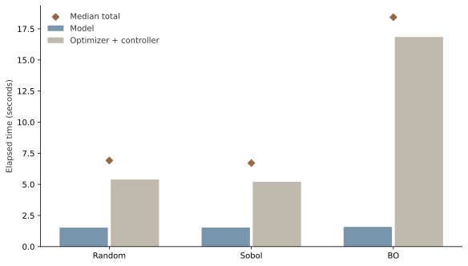
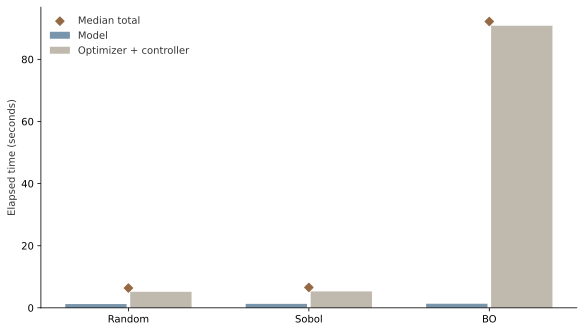
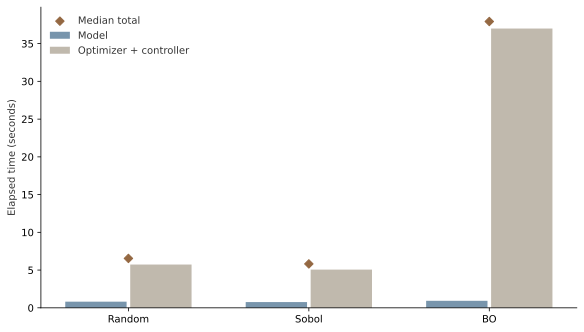
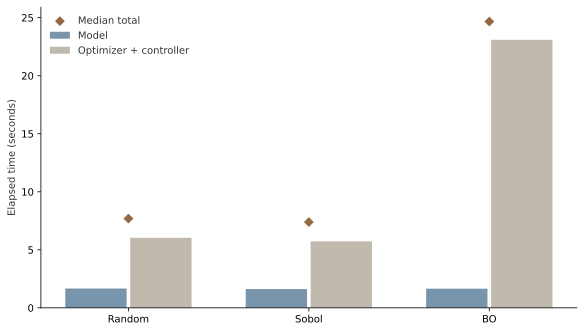
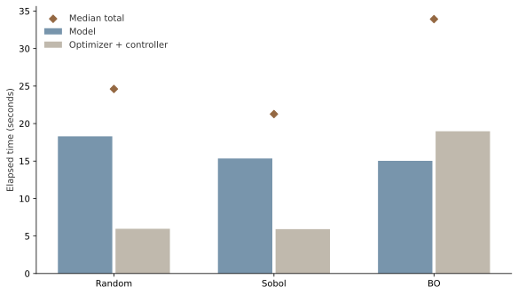
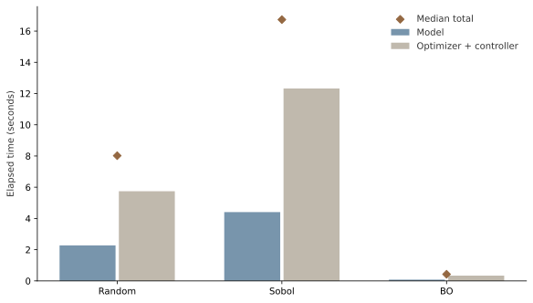
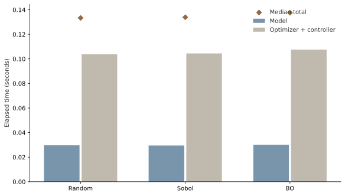
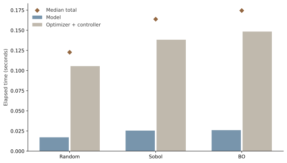
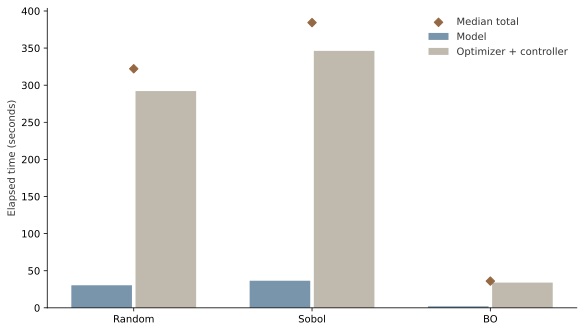
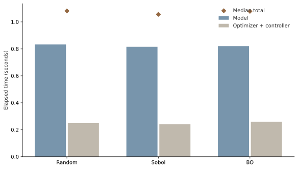
<script type="application/json" id="data-runtime">{"default": 3, "variants": [{"data": [{"hovertemplate": "Model<br>%{x}<br>%{y:.3f} seconds<extra><\/extra>", "marker": {"color": "#7895AC"}, "name": "Model", "x": ["Random", "Sobol", "BO"], "y": [1.5309879630804062, 1.5340271606110036, 1.587333658710122], "type": "bar"}, {"hovertemplate": "Optimizer + controller<br>%{x}<br>%{y:.3f} seconds<extra><\/extra>", "marker": {"color": "#C0B9AD"}, "name": "Optimizer + controller", "x": ["Random", "Sobol", "BO"], "y": [5.390333411749452, 5.211686703842133, 16.844634133391082], "type": "bar"}, {"marker": {"color": "#946842", "size": 10, "symbol": "diamond"}, "mode": "markers", "name": "Median total", "x": ["Random", "Sobol", "BO"], "y": [6.9213213748298585, 6.716337833087891, 18.431967792101204], "type": "scatter"}], "layout": {"template": {"data": {"scatter": [{"type": "scatter"}]}}, "barmode": "group", "yaxis": {"title": {"text": "Elapsed time (seconds)", "standoff": 12}, "rangemode": "tozero", "automargin": true, "gridcolor": "#dddddd", "zeroline": false}, "font": {"family": "Arial, sans-serif", "size": 13, "color": "#333333"}, "margin": {"t": 35, "r": 25, "b": 160, "l": 75}, "legend": {"orientation": "h", "x": 0, "y": -0.2, "xanchor": "left", "yanchor": "top"}, "hoverlabel": {"font": {"size": 12}}, "title": {}, "height": 510, "autosize": true, "paper_bgcolor": "rgba(0,0,0,0)", "plot_bgcolor": "rgba(0,0,0,0)", "showlegend": true, "xaxis": {"title": {"standoff": 12}, "automargin": true, "gridcolor": "#dddddd", "zeroline": false}}}, {"data": [{"hovertemplate": "Model<br>%{x}<br>%{y:.3f} seconds<extra><\/extra>", "marker": {"color": "#7895AC"}, "name": "Model", "x": ["Random", "Sobol", "BO"], "y": [1.215109918732196, 1.279826793819666, 1.3146545477211475], "type": "bar"}, {"hovertemplate": "Optimizer + controller<br>%{x}<br>%{y:.3f} seconds<extra><\/extra>", "marker": {"color": "#C0B9AD"}, "name": "Optimizer + controller", "x": ["Random", "Sobol", "BO"], "y": [5.159823127556592, 5.282130706124008, 90.8059386597015], "type": "bar"}, {"marker": {"color": "#946842", "size": 10, "symbol": "diamond"}, "mode": "markers", "name": "Median total", "x": ["Random", "Sobol", "BO"], "y": [6.373057291842997, 6.561957499943674, 92.17556770797819], "type": "scatter"}], "layout": {"template": {"data": {"scatter": [{"type": "scatter"}]}}, "barmode": "group", "yaxis": {"title": {"text": "Elapsed time (seconds)", "standoff": 12}, "rangemode": "tozero", "automargin": true, "gridcolor": "#dddddd", "zeroline": false}, "font": {"family": "Arial, sans-serif", "size": 13, "color": "#333333"}, "margin": {"t": 35, "r": 25, "b": 160, "l": 75}, "legend": {"orientation": "h", "x": 0, "y": -0.2, "xanchor": "left", "yanchor": "top"}, "hoverlabel": {"font": {"size": 12}}, "title": {}, "height": 510, "autosize": true, "paper_bgcolor": "rgba(0,0,0,0)", "plot_bgcolor": "rgba(0,0,0,0)", "showlegend": true, "xaxis": {"title": {"standoff": 12}, "automargin": true, "gridcolor": "#dddddd", "zeroline": false}}}, {"data": [{"hovertemplate": "Model<br>%{x}<br>%{y:.3f} seconds<extra><\/extra>", "marker": {"color": "#7895AC"}, "name": "Model", "x": ["Random", "Sobol", "BO"], "y": [0.8137332042679191, 0.7639010781422257, 0.9301238805055618], "type": "bar"}, {"hovertemplate": "Optimizer + controller<br>%{x}<br>%{y:.3f} seconds<extra><\/extra>", "marker": {"color": "#C0B9AD"}, "name": "Optimizer + controller", "x": ["Random", "Sobol", "BO"], "y": [5.731022878549993, 5.064960918389261, 36.99815711937845], "type": "bar"}, {"marker": {"color": "#946842", "size": 10, "symbol": "diamond"}, "mode": "markers", "name": "Median total", "x": ["Random", "Sobol", "BO"], "y": [6.544756082817912, 5.818230166565627, 37.92828099988401], "type": "scatter"}], "layout": {"template": {"data": {"scatter": [{"type": "scatter"}]}}, "barmode": "group", "yaxis": {"title": {"text": "Elapsed time (seconds)", "standoff": 12}, "rangemode": "tozero", "automargin": true, "gridcolor": "#dddddd", "zeroline": false}, "font": {"family": "Arial, sans-serif", "size": 13, "color": "#333333"}, "margin": {"t": 35, "r": 25, "b": 160, "l": 75}, "legend": {"orientation": "h", "x": 0, "y": -0.2, "xanchor": "left", "yanchor": "top"}, "hoverlabel": {"font": {"size": 12}}, "title": {}, "height": 510, "autosize": true, "paper_bgcolor": "rgba(0,0,0,0)", "plot_bgcolor": "rgba(0,0,0,0)", "showlegend": true, "xaxis": {"title": {"standoff": 12}, "automargin": true, "gridcolor": "#dddddd", "zeroline": false}}}, {"data": [{"hovertemplate": "Model<br>%{x}<br>%{y:.3f} seconds<extra><\/extra>", "marker": {"color": "#7895AC"}, "name": "Model", "x": ["Random", "Sobol", "BO"], "y": [1.6602239226922393, 1.6152119520120323, 1.6485966574400663], "type": "bar"}, {"hovertemplate": "Optimizer + controller<br>%{x}<br>%{y:.3f} seconds<extra><\/extra>", "marker": {"color": "#C0B9AD"}, "name": "Optimizer + controller", "x": ["Random", "Sobol", "BO"], "y": [6.031170285306871, 5.730066082440317, 23.091688871383667], "type": "bar"}, {"marker": {"color": "#946842", "size": 10, "symbol": "diamond"}, "mode": "markers", "name": "Median total", "x": ["Random", "Sobol", "BO"], "y": [7.69139420799911, 7.3896097503602505, 24.6705972077325], "type": "scatter"}], "layout": {"template": {"data": {"scatter": [{"type": "scatter"}]}}, "barmode": "group", "yaxis": {"title": {"text": "Elapsed time (seconds)", "standoff": 12}, "rangemode": "tozero", "automargin": true, "gridcolor": "#dddddd", "zeroline": false}, "font": {"family": "Arial, sans-serif", "size": 13, "color": "#333333"}, "margin": {"t": 35, "r": 25, "b": 160, "l": 75}, "legend": {"orientation": "h", "x": 0, "y": -0.2, "xanchor": "left", "yanchor": "top"}, "hoverlabel": {"font": {"size": 12}}, "title": {}, "height": 510, "autosize": true, "paper_bgcolor": "rgba(0,0,0,0)", "plot_bgcolor": "rgba(0,0,0,0)", "showlegend": true, "xaxis": {"title": {"standoff": 12}, "automargin": true, "gridcolor": "#dddddd", "zeroline": false}}}, {"data": [{"hovertemplate": "Model<br>%{x}<br>%{y:.3f} seconds<extra><\/extra>", "marker": {"color": "#7895AC"}, "name": "Model", "x": ["Random", "Sobol", "BO"], "y": [18.29814187483862, 15.342338756192476, 15.024845707695931], "type": "bar"}, {"hovertemplate": "Optimizer + controller<br>%{x}<br>%{y:.3f} seconds<extra><\/extra>", "marker": {"color": "#C0B9AD"}, "name": "Optimizer + controller", "x": ["Random", "Sobol", "BO"], "y": [5.969251086935401, 5.923284743912518, 18.970679095946252], "type": "bar"}, {"marker": {"color": "#946842", "size": 10, "symbol": "diamond"}, "mode": "markers", "name": "Median total", "x": ["Random", "Sobol", "BO"], "y": [24.61015887511894, 21.265623500104994, 33.92796237533912], "type": "scatter"}], "layout": {"template": {"data": {"scatter": [{"type": "scatter"}]}}, "barmode": "group", "yaxis": {"title": {"text": "Elapsed time (seconds)", "standoff": 12}, "rangemode": "tozero", "automargin": true, "gridcolor": "#dddddd", "zeroline": false}, "font": {"family": "Arial, sans-serif", "size": 13, "color": "#333333"}, "margin": {"t": 35, "r": 25, "b": 160, "l": 75}, "legend": {"orientation": "h", "x": 0, "y": -0.2, "xanchor": "left", "yanchor": "top"}, "hoverlabel": {"font": {"size": 12}}, "title": {}, "height": 510, "autosize": true, "paper_bgcolor": "rgba(0,0,0,0)", "plot_bgcolor": "rgba(0,0,0,0)", "showlegend": true, "xaxis": {"title": {"standoff": 12}, "automargin": true, "gridcolor": "#dddddd", "zeroline": false}}}, {"data": [{"hovertemplate": "Model<br>%{x}<br>%{y:.3f} seconds<extra><\/extra>", "marker": {"color": "#7895AC"}, "name": "Model", "x": ["Random", "Sobol", "BO"], "y": [2.2768908427096903, 4.409441229887307, 0.08485374925658107], "type": "bar"}, {"hovertemplate": "Optimizer + controller<br>%{x}<br>%{y:.3f} seconds<extra><\/extra>", "marker": {"color": "#C0B9AD"}, "name": "Optimizer + controller", "x": ["Random", "Sobol", "BO"], "y": [5.7447097399272025, 12.32305477000773, 0.34024983225390315], "type": "bar"}, {"marker": {"color": "#946842", "size": 10, "symbol": "diamond"}, "mode": "markers", "name": "Median total", "x": ["Random", "Sobol", "BO"], "y": [8.021600582636893, 16.732495999895036, 0.4283306668512523], "type": "scatter"}], "layout": {"template": {"data": {"scatter": [{"type": "scatter"}]}}, "barmode": "group", "yaxis": {"title": {"text": "Elapsed time (seconds)", "standoff": 12}, "rangemode": "tozero", "automargin": true, "gridcolor": "#dddddd", "zeroline": false}, "font": {"family": "Arial, sans-serif", "size": 13, "color": "#333333"}, "margin": {"t": 35, "r": 25, "b": 160, "l": 75}, "legend": {"orientation": "h", "x": 0, "y": -0.2, "xanchor": "left", "yanchor": "top"}, "hoverlabel": {"font": {"size": 12}}, "title": {}, "height": 510, "autosize": true, "paper_bgcolor": "rgba(0,0,0,0)", "plot_bgcolor": "rgba(0,0,0,0)", "showlegend": true, "xaxis": {"title": {"standoff": 12}, "automargin": true, "gridcolor": "#dddddd", "zeroline": false}}}, {"data": [{"hovertemplate": "Model<br>%{x}<br>%{y:.3f} seconds<extra><\/extra>", "marker": {"color": "#7895AC"}, "name": "Model", "x": ["Random", "Sobol", "BO"], "y": [0.029638126026839018, 0.029473374597728252, 0.030039667151868343], "type": "bar"}, {"hovertemplate": "Optimizer + controller<br>%{x}<br>%{y:.3f} seconds<extra><\/extra>", "marker": {"color": "#C0B9AD"}, "name": "Optimizer + controller", "x": ["Random", "Sobol", "BO"], "y": [0.10370587417855859, 0.1044252086430788, 0.10755658289417624], "type": "bar"}, {"marker": {"color": "#946842", "size": 10, "symbol": "diamond"}, "mode": "markers", "name": "Median total", "x": ["Random", "Sobol", "BO"], "y": [0.1333440002053976, 0.13389858324080706, 0.1375962500460446], "type": "scatter"}], "layout": {"template": {"data": {"scatter": [{"type": "scatter"}]}}, "barmode": "group", "yaxis": {"title": {"text": "Elapsed time (seconds)", "standoff": 12}, "rangemode": "tozero", "automargin": true, "gridcolor": "#dddddd", "zeroline": false}, "font": {"family": "Arial, sans-serif", "size": 13, "color": "#333333"}, "margin": {"t": 35, "r": 25, "b": 160, "l": 75}, "legend": {"orientation": "h", "x": 0, "y": -0.2, "xanchor": "left", "yanchor": "top"}, "hoverlabel": {"font": {"size": 12}}, "title": {}, "height": 510, "autosize": true, "paper_bgcolor": "rgba(0,0,0,0)", "plot_bgcolor": "rgba(0,0,0,0)", "showlegend": true, "xaxis": {"title": {"standoff": 12}, "automargin": true, "gridcolor": "#dddddd", "zeroline": false}}}, {"data": [{"hovertemplate": "Model<br>%{x}<br>%{y:.3f} seconds<extra><\/extra>", "marker": {"color": "#7895AC"}, "name": "Model", "x": ["Random", "Sobol", "BO"], "y": [0.017165458761155605, 0.02548904251307249, 0.026061417069286108], "type": "bar"}, {"hovertemplate": "Optimizer + controller<br>%{x}<br>%{y:.3f} seconds<extra><\/extra>", "marker": {"color": "#C0B9AD"}, "name": "Optimizer + controller", "x": ["Random", "Sobol", "BO"], "y": [0.10554616618901491, 0.1383257913403213, 0.14845366682857275], "type": "bar"}, {"marker": {"color": "#946842", "size": 10, "symbol": "diamond"}, "mode": "markers", "name": "Median total", "x": ["Random", "Sobol", "BO"], "y": [0.12271162495017052, 0.1638148338533938, 0.17451508389785886], "type": "scatter"}], "layout": {"template": {"data": {"scatter": [{"type": "scatter"}]}}, "barmode": "group", "yaxis": {"title": {"text": "Elapsed time (seconds)", "standoff": 12}, "rangemode": "tozero", "automargin": true, "gridcolor": "#dddddd", "zeroline": false}, "font": {"family": "Arial, sans-serif", "size": 13, "color": "#333333"}, "margin": {"t": 35, "r": 25, "b": 160, "l": 75}, "legend": {"orientation": "h", "x": 0, "y": -0.2, "xanchor": "left", "yanchor": "top"}, "hoverlabel": {"font": {"size": 12}}, "title": {}, "height": 510, "autosize": true, "paper_bgcolor": "rgba(0,0,0,0)", "plot_bgcolor": "rgba(0,0,0,0)", "showlegend": true, "xaxis": {"title": {"standoff": 12}, "automargin": true, "gridcolor": "#dddddd", "zeroline": false}}}, {"data": [{"hovertemplate": "Model<br>%{x}<br>%{y:.3f} seconds<extra><\/extra>", "marker": {"color": "#7895AC"}, "name": "Model", "x": ["Random", "Sobol", "BO"], "y": [30.411490336060524, 36.5524418996647, 2.028009998612106], "type": "bar"}, {"hovertemplate": "Optimizer + controller<br>%{x}<br>%{y:.3f} seconds<extra><\/extra>", "marker": {"color": "#C0B9AD"}, "name": "Optimizer + controller", "x": ["Random", "Sobol", "BO"], "y": [292.07563234167174, 346.30136507656425, 33.98430321039632], "type": "bar"}, {"marker": {"color": "#946842", "size": 10, "symbol": "diamond"}, "mode": "markers", "name": "Median total", "x": ["Random", "Sobol", "BO"], "y": [322.1393101667054, 384.3277548342012, 36.012313209008425], "type": "scatter"}], "layout": {"template": {"data": {"scatter": [{"type": "scatter"}]}}, "barmode": "group", "yaxis": {"title": {"text": "Elapsed time (seconds)", "standoff": 12}, "rangemode": "tozero", "automargin": true, "gridcolor": "#dddddd", "zeroline": false}, "font": {"family": "Arial, sans-serif", "size": 13, "color": "#333333"}, "margin": {"t": 35, "r": 25, "b": 160, "l": 75}, "legend": {"orientation": "h", "x": 0, "y": -0.2, "xanchor": "left", "yanchor": "top"}, "hoverlabel": {"font": {"size": 12}}, "title": {}, "height": 510, "autosize": true, "paper_bgcolor": "rgba(0,0,0,0)", "plot_bgcolor": "rgba(0,0,0,0)", "showlegend": true, "xaxis": {"title": {"standoff": 12}, "automargin": true, "gridcolor": "#dddddd", "zeroline": false}}}, {"data": [{"hovertemplate": "Model<br>%{x}<br>%{y:.3f} seconds<extra><\/extra>", "marker": {"color": "#7895AC"}, "name": "Model", "x": ["Random", "Sobol", "BO"], "y": [0.8327186657115817, 0.8158075413666666, 0.8198375408537686], "type": "bar"}, {"hovertemplate": "Optimizer + controller<br>%{x}<br>%{y:.3f} seconds<extra><\/extra>", "marker": {"color": "#C0B9AD"}, "name": "Optimizer + controller", "x": ["Random", "Sobol", "BO"], "y": [0.24856745917350054, 0.24055070849135518, 0.2588295009918511], "type": "bar"}, {"marker": {"color": "#946842", "size": 10, "symbol": "diamond"}, "mode": "markers", "name": "Median total", "x": ["Random", "Sobol", "BO"], "y": [1.0812861248850822, 1.0563582498580217, 1.0786670418456197], "type": "scatter"}], "layout": {"template": {"data": {"scatter": [{"type": "scatter"}]}}, "barmode": "group", "yaxis": {"title": {"text": "Elapsed time (seconds)", "standoff": 12}, "rangemode": "tozero", "automargin": true, "gridcolor": "#dddddd", "zeroline": false}, "font": {"family": "Arial, sans-serif", "size": 13, "color": "#333333"}, "margin": {"t": 35, "r": 25, "b": 160, "l": 75}, "legend": {"orientation": "h", "x": 0, "y": -0.2, "xanchor": "left", "yanchor": "top"}, "hoverlabel": {"font": {"size": 12}}, "title": {}, "height": 510, "autosize": true, "paper_bgcolor": "rgba(0,0,0,0)", "plot_bgcolor": "rgba(0,0,0,0)", "showlegend": true, "xaxis": {"title": {"standoff": 12}, "automargin": true, "gridcolor": "#dddddd", "zeroline": false}}}]}</script>
</section>
```

Bars show the median of each time component separately; diamonds show median total study time. Medians need not add, so the bars are not stacked. Fixed studies have equal call budgets. Target-study times end at different targets or caps and must be interpreted with the attainment figure. Imports and held-out scoring are excluded. Cached target timings and uncached fixed timings are separate experiments; background tests overlapped some target runs.

## Parameter count and model cost measure different things

```{=html}
<section class="figure-block" id="complexity">
<div class="interactive-plot" id="plot-complexity" role="img" aria-label="Parameter count and model cost measure different things"></div>
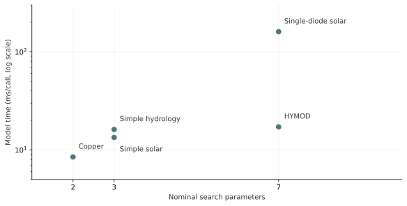
<script type="application/json" id="data-complexity">{"default": 0, "variants": [{"data": [{"customdata": ["Simple hydrology", "Simple solar", "Copper", "HYMOD", "Single-diode solar"], "hovertemplate": "%{customdata}<br>%{x} parameters<br>%{y:.2f} ms/call<extra><\/extra>", "marker": {"color": "#4B737A", "size": 12}, "mode": "markers", "x": [3, 3, 2, 7, 7], "y": [16.1573150883972, 13.4119161569591, 8.47638754445749, 17.172881848334026, 160.33146566769574], "type": "scatter"}], "layout": {"template": {"data": {"scatter": [{"type": "scatter"}]}}, "annotations": [{"showarrow": false, "text": "Simple hydrology", "x": 3, "xanchor": "left", "xshift": 12, "y": 1.2083691943611803, "yshift": 12}, {"showarrow": false, "text": "Simple solar", "x": 3, "xanchor": "left", "xshift": 12, "y": 1.1274908298236015, "yshift": -20}, {"showarrow": false, "text": "Copper", "x": 2, "xanchor": "left", "xshift": 12, "y": 0.9282108046423142, "yshift": 12}, {"showarrow": false, "text": "HYMOD", "x": 7, "xanchor": "left", "xshift": 12, "y": 1.2348431819289876, "yshift": 12}, {"showarrow": false, "text": "Single-diode solar", "x": 7, "xanchor": "left", "xshift": 12, "y": 2.205018762683662, "yshift": 12}], "xaxis": {"title": {"text": "Nominal search parameters", "standoff": 12}, "range": [1, 10], "tickvals": [2, 3, 7], "automargin": true, "gridcolor": "#dddddd", "zeroline": false}, "yaxis": {"title": {"text": "Model time (ms/call, log scale)", "standoff": 12}, "type": "log", "range": [0.6989700043360189, 2.4771212547196626], "tickmode": "array", "tickvals": [5, 10, 20, 50, 100, 200], "minorloglabels": "none", "automargin": true, "gridcolor": "#dddddd", "zeroline": false}, "font": {"family": "Arial, sans-serif", "size": 13, "color": "#333333"}, "margin": {"t": 35, "r": 25, "b": 85, "l": 75}, "legend": {"orientation": "h", "x": 0, "y": -0.2, "xanchor": "left", "yanchor": "top"}, "hoverlabel": {"font": {"size": 12}}, "title": {}, "height": 430, "autosize": true, "paper_bgcolor": "rgba(0,0,0,0)", "plot_bgcolor": "rgba(0,0,0,0)", "showlegend": false}}]}</script>
</section>
```

Parameter counts are read from the declared search spaces; a categorical choice counts as one parameter. Cost is the median, across fixed studies, of each study's model time divided by calls. These are implementation- and dataset-specific timings, not an intrinsic complexity score. Effective dimension and interaction strength have not been estimated here.

## Solar: a small improvement survives the temporal split

```{=html}
<section class="figure-block" id="solar-chain">
<div class="interactive-plot" id="plot-solar-chain" role="img" aria-label="Solar: a small improvement survives the temporal split"></div>
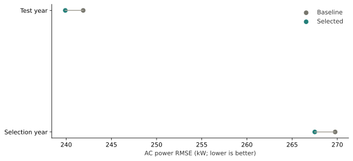
<script type="application/json" id="data-solar-chain">{"default": 0, "variants": [{"data": [{"hoverinfo": "skip", "line": {"color": "#A8A59B"}, "mode": "lines", "showlegend": false, "x": [269.7657086989648, 267.50710313756935], "y": ["Selection year", "Selection year"], "type": "scatter"}, {"hoverinfo": "skip", "line": {"color": "#A8A59B"}, "mode": "lines", "showlegend": false, "x": [241.8798560295896, 239.89961918147378], "y": ["Test year", "Test year"], "type": "scatter"}, {"hovertemplate": "Baseline<br>%{y}<br>%{x:.4f} kW<extra><\/extra>", "marker": {"color": "#77766D", "size": 12}, "mode": "markers", "name": "Baseline", "x": [269.7657086989648, 241.8798560295896], "y": ["Selection year", "Test year"], "type": "scatter"}, {"hovertemplate": "Selected<br>%{y}<br>%{x:.4f} kW<extra><\/extra>", "marker": {"color": "#237F79", "size": 12}, "mode": "markers", "name": "Selected", "x": [267.50710313756935, 239.89961918147378], "y": ["Selection year", "Test year"], "type": "scatter"}], "layout": {"template": {"data": {"scatter": [{"type": "scatter"}]}}, "xaxis": {"title": {"text": "AC power RMSE (kW; lower is better)", "standoff": 12}, "automargin": true, "gridcolor": "#dddddd", "zeroline": false}, "font": {"family": "Arial, sans-serif", "size": 13, "color": "#333333"}, "margin": {"t": 35, "r": 25, "b": 160, "l": 75}, "legend": {"orientation": "h", "x": 0, "y": -0.2, "xanchor": "left", "yanchor": "top"}, "hoverlabel": {"font": {"size": 12}}, "title": {}, "height": 410, "autosize": true, "paper_bgcolor": "rgba(0,0,0,0)", "plot_bgcolor": "rgba(0,0,0,0)", "showlegend": true, "yaxis": {"title": {"standoff": 12}, "automargin": true, "gridcolor": "#dddddd", "zeroline": false}}}]}</script>
</section>
```

Baseline and selected thermal components are scored on the same rows within each year. Selection uses 2018; the final comparison uses 2019. This is conditional on measured plane-of-array irradiance, not an irradiance forecasting test. The temporal holdout was inspected during development and is not blind external validation. Implausible module-temperature observations invalidate that diagnostic, while the AC objective is retained.

## Wind: the apparent gain depends strongly on the direction grid

```{=html}
<section class="figure-block" id="wind-chain">
<div class="interactive-plot" id="plot-wind-chain" role="img" aria-label="Wind: the apparent gain depends strongly on the direction grid"></div>
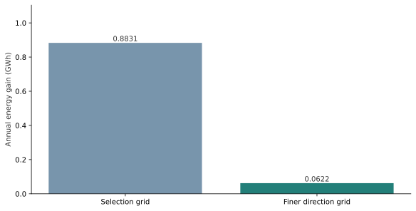
<script type="application/json" id="data-wind-chain">{"default": 0, "variants": [{"data": [{"hovertemplate": "%{x}<br>%{y:.6f} GWh<extra><\/extra>", "marker": {"color": ["#7895AC", "#237F79"]}, "text": ["0.8831", "0.0622"], "textposition": "outside", "x": ["Selection grid", "Finer direction grid"], "y": [0.8831302913196168, 0.06219108706270049], "type": "bar"}], "layout": {"template": {"data": {"scatter": [{"type": "scatter"}]}}, "yaxis": {"title": {"text": "Selected minus baseline annual energy (GWh)", "standoff": 12}, "range": [0, 1.103912864149521], "automargin": true, "gridcolor": "#dddddd", "zeroline": false}, "font": {"family": "Arial, sans-serif", "size": 13, "color": "#333333"}, "margin": {"t": 35, "r": 25, "b": 85, "l": 75}, "legend": {"orientation": "h", "x": 0, "y": -0.2, "xanchor": "left", "yanchor": "top"}, "hoverlabel": {"font": {"size": 12}}, "title": {}, "height": 440, "autosize": true, "paper_bgcolor": "rgba(0,0,0,0)", "plot_bgcolor": "rgba(0,0,0,0)", "showlegend": false, "xaxis": {"title": {"standoff": 12}, "automargin": true, "gridcolor": "#dddddd", "zeroline": false}}}]}</script>
</section>
```

Both comparisons use the same NOJ wake model. The finer grid is a sensitivity check, not observed plant validation. TOPFARM reached its iteration limits without convergence; the layouts are feasible bounded iterates. The smaller gain on the finer grid limits the design claim.

## Hybrid: the highest-revenue candidate fails the SOC screen

```{=html}
<section class="figure-block" id="hybrid-chain">
<div class="interactive-plot" id="plot-hybrid-chain" role="img" aria-label="Hybrid: the highest-revenue candidate fails the SOC screen"></div>
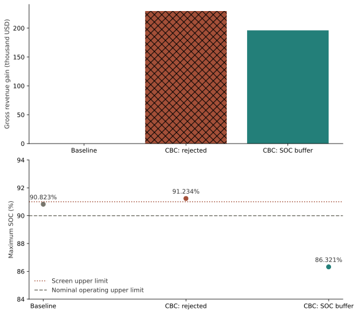
<script type="application/json" id="data-hybrid-chain">{"default": 0, "variants": [{"data": [{"customdata": ["evaluated", "infeasible", "evaluated"], "hovertemplate": "%{x}<br>%{y:.3f} thousand USD<br>%{customdata}<extra><\/extra>", "marker": {"color": ["#77766D", "#A34F38", "#237F79"], "pattern": {"shape": ["", "x", ""]}}, "showlegend": false, "x": ["Baseline", "CBC: rejected", "CBC: SOC buffer"], "y": [0.0, 229.5836012675874, 196.17267772000469], "type": "bar", "xaxis": "x", "yaxis": "y"}, {"marker": {"color": ["#77766D", "#A34F38", "#237F79"], "size": 11}, "mode": "markers+text", "showlegend": false, "text": ["90.823%", "91.234%", "86.321%"], "textposition": "top center", "x": ["Baseline", "CBC: rejected", "CBC: SOC buffer"], "y": [90.82276944843447, 91.23432861631625, 86.32073506386814], "type": "scatter", "xaxis": "x2", "yaxis": "y2"}], "layout": {"template": {"data": {"scatter": [{"type": "scatter"}]}}, "xaxis": {"anchor": "y", "domain": [0.0, 1.0], "title": {"standoff": 12}, "automargin": true, "gridcolor": "#dddddd", "zeroline": false}, "yaxis": {"anchor": "x", "domain": [0.62, 1.0], "title": {"text": "Gain (thousand USD)", "standoff": 12}, "rangemode": "tozero", "automargin": true, "gridcolor": "#dddddd", "zeroline": false}, "xaxis2": {"anchor": "y2", "domain": [0.0, 1.0], "title": {"standoff": 12}, "automargin": true, "gridcolor": "#dddddd", "zeroline": false}, "yaxis2": {"anchor": "x2", "domain": [0.0, 0.38], "title": {"text": "Maximum SOC (%)", "standoff": 12}, "range": [84, 94], "automargin": true, "gridcolor": "#dddddd", "zeroline": false}, "annotations": [{"font": {"size": 16}, "showarrow": false, "text": "Annual gross revenue gain", "x": 0.5, "xanchor": "center", "xref": "paper", "y": 1.0, "yanchor": "bottom", "yref": "paper"}, {"font": {"size": 16}, "showarrow": false, "text": "Maximum simulated state of charge", "x": 0.5, "xanchor": "center", "xref": "paper", "y": 0.38, "yanchor": "bottom", "yref": "paper"}], "shapes": [{"line": {"color": "#A34F38", "dash": "dot"}, "type": "line", "x0": 0, "x1": 1, "xref": "x2 domain", "y0": 91, "y1": 91, "yref": "y2"}, {"line": {"color": "#77766D", "dash": "dash"}, "type": "line", "x0": 0, "x1": 1, "xref": "x2 domain", "y0": 90, "y1": 90, "yref": "y2"}], "font": {"family": "Arial, sans-serif", "size": 13, "color": "#333333"}, "margin": {"t": 35, "r": 25, "b": 85, "l": 75}, "legend": {"orientation": "h", "x": 0, "y": -0.2, "xanchor": "left", "yanchor": "top"}, "hoverlabel": {"font": {"size": 12}}, "title": {}, "height": 740, "autosize": true, "paper_bgcolor": "rgba(0,0,0,0)", "plot_bgcolor": "rgba(0,0,0,0)", "showlegend": false}}]}</script>
</section>
```

Hatching marks the excluded CBC policy. The buffered policy is selected from candidates that pass the unchanged screens. The dotted line is the 91% screening upper limit; the dashed line is the nominal 90% operating upper limit. The screen includes numerical tolerance and is not strict operating-limit certification. Revenue assumes perfect 24-hour foresight, a separate price-year scenario, and omits capital, degradation and terminal SOC value. It is neither forecast skill nor realized income.

